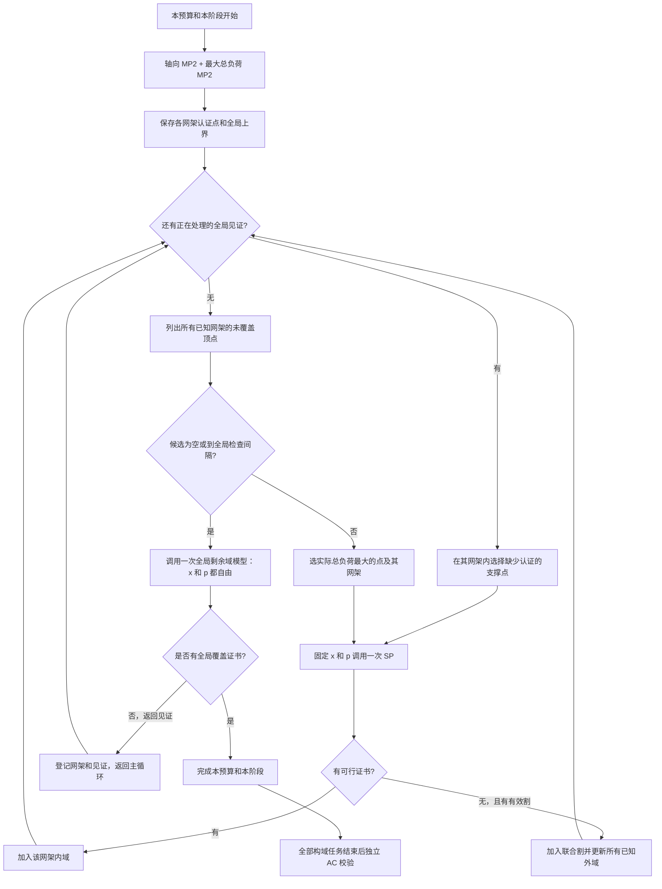

# 主线流程重构方案（已执行，保留审核记录）

2026-09-27。此方案已经按用户补充要求实施：删去主线冗余检查与支撑失败后的替代点分支，默认仅运行 SOCP，精简重复记录。下文保留原审核内容和当时行号；当前实现说明以 `docs/continuous_region.md` 和代码为准。

## 1. 建议采用的结构

**把“下一步做什么”的决定全部集中到 `main.py`：轴向 MP2 初始化 → 选点和网架 → 单次 SP → 更新区域 → 再选点；需要寻找遗漏网架、内部空隙或判定完成时，显式调用剩余域模型。全部构域完成后，再进行独立 AC 校验。**

具体采用以下规则：

1. 初始化解各坐标方向的 MP2，再解一次最大总负荷 MP2；取消默认 MP1 初始化。
2. 日常候选来自**已知网架的待验证外域顶点**，优先选择实际总负荷最大的点；同一轮同时确定配套网架。
3. 保留全局剩余域模型，负责寻找未知网架或内部遗漏，以及给出最终覆盖证书。它不再充当日常顶点的排序规则。
4. `main.py` 只有一个构域主循环。每轮至多调用一次优化求解器：一次 SP，或者一次剩余域求解。模型内部不再决定接下来调用谁。
5. `region.py` 只做凸包、裁剪、包含判断、几何支撑和状态存储；`model.py` 只建模并完成单次求解。
6. 保留 `build_continuous_region` 入口和现有结果字段，避免重构同时制造第二套接口。

这里的“顶点中负荷最大”只针对当时**已知网架**的候选，不能解释为已经求出了所有可能网架中最大的待验证顶点。发现未知网架仍需要全局模型。

## 2. 当前代码具体混在哪里

| 当前位置 | 当前行为 | 建议变化 |
|---|---|---|
| [main.py:76](D:/GithubProject/PlanRegion/main.py:76) | 先最大总负荷 MP2，再用 MP1 最小化达到该总量的投资 | 改为轴向 MP2 加总负荷 MP2，逐个保存证书 |
| [main.py:104](D:/GithubProject/PlanRegion/main.py:104) | 先按初始方案队列，再转剩余域搜索 | 去掉按初始方案分批调度，所有已知方案进入同一候选集合 |
| [main.py:131](D:/GithubProject/PlanRegion/main.py:131) | 当前方案内部再套一层最多 96 次 SP 的循环，交织见证、种子和普通选点 | 合并成一个主循环，每轮只执行一个明确动作 |
| [region.py:171](D:/GithubProject/PlanRegion/region.py:171) | `next_point` 隐藏选点策略；空内域取归一化坐标和最小，否则取最大 | 策略移到 `main.py`，统一按实际 kW 总量排序 |
| [region.py:181](D:/GithubProject/PlanRegion/region.py:181) | `witness_support` 返回支撑一个内部见证的几何点，当前调用方直接取第一个 | 几何计算保留，支撑点是否需要检查及检查顺序由 `main.py` 决定 |
| [model.py:402](D:/GithubProject/PlanRegion/model.py:402) | `evaluation_bounds` 不带本次预算，且求某轴时将其他负荷上限置零 | 本次外域改用预算内、其他负荷自由变化的方向 MP2 |
| [main.py:197](D:/GithubProject/PlanRegion/main.py:197) | 常规构域已经先算完各预算和方法，最后 AC；Concept5 则自动进入勘察 | 保留 AC 后置；明确“单次构域”和“勘察研究”两种入口用途 |

这不是把所有方程搬进 `main.py`。需要搬的是**调用次序、选点规则、选网架规则和停止判断**。

## 3. 第一步：轴向 MP2 怎样形成初始外域

固定本次预算 \(\mathcal B\) 和物理模型。对每个负荷坐标求解：

\[
\max_{x,p,y}\ p_i,
\qquad x\text{ 满足全部合法网架约束},\quad
c^Tx\le\mathcal B,\quad (x,p,y)\text{ 满足本阶段物理约束}.
\]

**其他 \(p_j\) 保持自由，不能为了求 \(p_i\) 的坐标上界而强制它们为零。** 这是求某个坐标的最大值；如果把其他负荷固定为零，求的是坐标轴截距，两者需要额外条件才能等同。

每次求解获得两种不同信息：

| 信息 | 用途 |
|---|---|
| 求解器给出的该方向全局上界 `answer['bound']` | 形成外域约束 \(p_i\le b_i^{\rm axis}(\mathcal B)\) |
| 经过求解质量检查的完整解 `answer['x'], answer['p'], answer['state']` | 将这个负荷点加入其对应网架的认证内域 |

外域必须使用**上界**，不能把一个尚未证明最优的可行解坐标当作所有网架的上界。不同方向可能返回不同网架；这些点按各自网架保存，不能跨网架取凸包。

另外保留一次最大总负荷 MP2：

\[
\max_{x,p,y}\ \mathbf1^Tp.
\]

它的全局上界仍记为 `region.total_bound`，保留当前 `max_total / max_total_bound / max_point / max_choice / max_cost` 的含义。因此一个 \(d\) 维构域实例初始化共 \(d+1\) 次 MP2；二维 3 次，三维 4 次。这里增加了初始化求解量，是否减少后续 SP 要用回归实验判断。

初始外域是：

\[
O_0(\mathcal B)=
\left\{p:\ 0\le p_i\le b_i^{\rm axis}(\mathcal B),\quad
\mathbf1^Tp\le\texttt{total\_bound}\right\}.
\]

这个箱体与总量半空间的交集只是外包络，角点不自动可行。已有联合割还要进一步限制每个具体网架的外域。

### 公共评价箱和本次坐标上界分开

保留现有 `bounds` 的含义：跨预算、方法和勘察状态共用的正数评价箱 \(b^{\rm box}\)，供归一化、绘图和 AC 网格使用。

新增提案量 `axis_bounds` 表示**本次预算和本阶段模型下**的坐标上界，单位 kW，形状 `(d,)`。它限制实际搜索外域；仍用 `point = p / bounds` 归一化。这样零坐标上界也不会导致除零，并且不会把不同预算的坐标系混在一起。

没有外部公共评价箱时，可以用现有总负荷约束给出的 `network.power_limit` 在每个坐标构造安全公共箱；本次的紧外域仍由轴向 MP2 得到。若传入的公共箱比所需搜索范围更小，应显式检查或说明研究范围，不能静默截断。

`axis_bounds` 必须同步进入：已有方案外域、新方案外域、剩余域模型的负荷上界、最终外包络及结果记录。不能只更新图上的箱体。

## 4. 主循环中究竟何时求哪个问题



求解超时、数值失败或者返回值不足以作出判断时，保留失败/未完成状态并终止本次求解，不进入图中的“有证书”分支。

### 4.1 日常选点：在 `main.py` 中直接看见排序

对每个已知网架 \(x\)，取当前外域顶点。延续现有精度约定，实际 SP 候选为：

\[
p=(1-\tau)\,\operatorname{diag}(\texttt{bounds})\,\xi^{\rm vertex}.
\]

过滤已被任一认证内域覆盖的普通候选，然后在所有剩余的 `(x, point)` 对中选择：

\[
\arg\max_{(x,p)\text{ 为当前候选}}\ \mathbf1^Tp.
\]

代码排序键是 `float(point @ bounds)`，不是 `point.sum()`。如果各坐标的公共箱尺度不同，后者并不代表实际总负荷。相同分数按固定网架顺序和坐标顺序打破平局，便于重复调试。

这里筛选的是各个 \(O_x\) 的已有顶点，不是显式计算差集 \(O_x\setminus\bigcup_{x'}I_{x'}\) 后的全部交点和碎片顶点。因此这是一条日常搜索策略，不是对完整剩余域顶点的穷举；下面的全局检查负责补足这个差别。

当 `tau=0` 时检查原外域顶点；`tau>0` 时检查收缩后的对应点。这一数值口径应在界面和日志中明确，不把收缩点标成原始边界顶点。

### 4.2 为什么不能只检查这些顶点就宣布结束

两个独立原因：

- 已知网架的集合可能不全，未知网架 C 可能提供新区域。
- 多个认证内域的并集一般不凸：一个外域的各顶点分别被不同网架覆盖，不代表内部也全部被覆盖。

因此“普通候选为空”只触发一次全局剩余域求解，不能触发完成。

剩余域模型允许预算内的全部合法 `x`，而非只选已经登记的 A、B。它在初始外域、累计联合割和拓扑/预算约束下寻找尚未被认证内域并集覆盖的 `(x,p)`。

现有 `max gamma` 可保留在该模型内部，用于发现遗漏和证明覆盖；**日常选点不再要求它选最大评分点**。现有求解器也允许找到足够正的见证就提前返回，并不总是求到最大评分的精确最优点。

为防止长期只细化已知网架，保留全局检查间隔：完成当前见证处理后，如果自上次全局检查以来 SP 次数达到 `REFINEMENT_CHECKS`，下一轮先调用全局模型。这个常量移到 `main.py`；由“每个网架的内层循环上限”迁移为“全局检查间隔”，需要记录语义变化。没有正在处理的见证且候选为空时，无需等到间隔。

### 4.3 内部见证怎样变成下一次 SP 的点

假设全局模型返回网架 C 和内部未覆盖点 \(p^w\)。`main.py` 显式完成：

1. 登记 C，利用当前全部有效割建立 C 的外域。
2. 计算归一化见证 `(1-tau) * witness['p'] / bounds`。
3. 调用 `region.witness_support`，仅计算能够以凸组合表示该见证的同网架几何支撑点。
4. 从尚未在 **C 自己的内域** 中认证的支撑点里，选择实际总负荷最大的一个。
5. 调用一次 `SP(C, p)`。下一轮根据更新后的域重新计算，避免使用割之前的过期支撑点。

支撑点可能包括几何中心，并不保证全部是外域顶点。这是处理内部遗漏的明确例外，不能将其包装成“始终只检查顶点”。如果之后要求严格只用顶点，应另行设计顶点凸组合分解并比较其效果，本次不同时更换该几何算法。

支撑点即使已由网架 A 认证，也可能仍需在 C 下检查，因为需要形成 **C 的同网架凸包**。普通顶点的“全局已覆盖则跳过”与支撑点的“当前网架已认证才跳过”要在 `main.py` 分开写明。

当见证已被认证内域覆盖，或者新联合割在该网架下排除了原始见证，就清除这项工作并恢复普通选点。切割判断用 `witness['p']` 的原始 kW 坐标，不混用收缩后的 `point`。

`physical` 模式的剩余域解自带本阶段可行证书。延续现有处理顺序：先完成需要的同网架支撑，再纳入该原始见证，避免先加入见证后因“已经覆盖自己”而跳过支撑工作。`light` 模式返回的候选不自带运行证书，必须通过 SP 才能加入内域。

### 4.4 A、B 都失败时，如何继续

SP 的对象是一个 `(x,p)` 对。A 下失败只排除 A 下不满足割的部分；不会把这个负荷点永久标记为全局不可行。

联合割保持现有形式：

\[
\alpha+\beta^Tp+\delta^Tx\ge0.
\]

它可加入包含全部 `x` 的全局模型，也可代入每个已知网架更新各自外域。不同网架代入不同 `x`，允许的负荷范围可能不同。

A、B 都不能支持该点时，主循环后续的全局剩余域求解仍能返回 C 及一个未覆盖点。**不需要为此再增设第四个常规优化问题，也不需要逐一枚举所有网架。** 这里求的是整个剩余区域，并不承诺下一次全局模型仍返回原来那个固定点。

若研究目的变成“必须立即给某一个固定点最终判决”，则应另外显式调用固定 `power=p`、`x` 自由的完整主问题；这属于可选的定点诊断，不放进默认构域循环。

## 5. 建议的 `main.py` 审核伪代码

以下是**控制流程草案，不是当前已可运行的代码**。模型构造参数、计时器、质量检查和日志细节略写；关键的选择与跳转全部展开。`direction`、`axis_bounds` 及纯几何 `tighten_bounds` 是待登记/实现的接口提案。

### 5.1 `run`：一次构域便于调试，批量实验复用同一入口

```python
def run(...):
    # 明确选择构域任务；勘察任务保留独立入口与自己的研究流程。
    # 调试时只配置一个 method、一个 budget；批量比较再扩展列表。
    bounds = ...  # 公共正数评价箱，整次实验不变
    result = ...

    for method in methods:
        for budget in budgets:
            region = build_continuous_region(
                network, method, budget, bounds, ...
            )
            result.add_region(region, ...)

    # 全部构域完成后，才进入独立 AC 阶段。
    ac = validate_ac_region(network, budgets, divisions, bounds, ...)
    result.add_validation(ac, ...)
    # 保存结果并显示。
```

二维勘察目前使用 `audit_results` 做结束后的 AC 审核，不能直接替换为面向三维网格的 `validate_ac_region`。保留相应校验器，并保证构域循环本身不做 AC。

### 5.2 `build_continuous_region`：初始化就在文件里展开

```python
for phase in phases:
    equations = GridPhysics(network, phase)
    region = RegionState(bounds, network.power_limit, tau_for_phase, cuts)
    oracle = SubProblem(equations, ...)
    axis_bounds = bounds.copy()  # 待轴向 MP2 逐项收紧
    witness = None
    sp_since_global = 0
    status = 'unknown'

    # d 个坐标目标，再加一个总负荷目标。
    for index, direction in enumerate([*np.eye(d), np.ones(d)]):
        report('mp_start', ...)
        problem = MasterProblem(
            equations, budget=budget, direction=direction,
            cuts=region.cuts, ...
        )
        with problem.model:
            answer = problem.solve(time_limit=remaining_time(MP_TIME_LIMIT))
        report('query_end', answer=answer, ...)

        if answer is None:
            # 此模型含完整物理约束且 x 自由：本预算下已证无可行解。
            # 任一更早方向已有可行证书时出现此结果，应报不一致错误。
            # 否则直接按空域汇总本阶段，不进入 SP 循环。
            ...

        if index < d:
            axis_bounds[index] = answer['bound']
        else:
            maximum_answer = answer
            maximum = float(answer['p'].sum())
            region.total_bound = min(network.power_limit, answer['bound'])

        # 纯几何操作：同步本次边界，裁剪已经登记的外域。
        region.tighten_bounds(axis_bounds, region.total_bound)
        x = answer['x']
        region.add_scheme(x, network.decode_plan(x), network.cost @ x)
        region.add_point(x, answer['p'] / bounds)
        report('feasible', point=answer['p'], ...)

    # 紧接下面的单一 while 循环；默认不再调用 MP1。
```

轴向 MP2 和总负荷 MP2 都含完整的本阶段运行约束，经过质量检查后可直接提供本阶段证书，无需再用同一个 SP 重复认证同一 `(x,p)`。这些是线性/SOCP 模型证书，最终 AC 结论另行报告。

### 5.3 单一主循环：一次循环，最多一次优化求解

```python
while True:
    remaining_time(np.inf)
    candidate = None  # (x, point)，point 为归一化坐标

    # A. 处理上次全局模型发现的内部见证；这里只做几何判断。
    if witness is not None:
        x = witness['x']
        point = (1 - region.tau) * witness['p'] / bounds
        covered = region.covering_schemes([point], preferred=x)[0] is not None

        if covered:
            if witness['feasible']:
                region.add_point(x, witness['p'] / bounds)
            witness = None
        else:
            support = region.witness_support(x, point)
            missing = [q for q in support
                       if not contains([q], region.inner_equations(x))[0]]
            if not missing:
                # 保留现有数值边界情况下直接检查见证的处理。
                missing = [point]
            point = max(missing, key=lambda q: float(q @ bounds))
            candidate = (x, point)
            point_reason = '补齐全局见证的同网架支撑'

    # B. 没有活动见证时，直接在 main.py 枚举普通顶点候选。
    if candidate is None:
        candidates = []
        for row in region.records.values():
            targets = (1 - region.tau) * row['outer']
            owners = region.covering_schemes(targets, preferred=row['x'])
            for point, owner in zip(targets, owners):
                if owner is None:
                    candidates.append((row['x'], point))

        if not candidates or sp_since_global >= REFINEMENT_CHECKS:
            # C. 这里且仅在这里调用全局剩余域问题；x 不固定。
            report('residual_start', ...)
            problem = RemainingRegionModel(
                equations, budget, bounds, region.total_bound,
                region.cuts, region.inner_halfspaces(), region.tau,
                axis_bounds=axis_bounds, mode=residual_mode, ...
            )
            with problem.model:
                witness = problem.solve(
                    GEOMETRY_TOL,
                    time_limit=remaining_time(RESIDUAL_TIME_LIMIT)
                )
            report('residual_end', answer=witness, ...)
            coverage = witness['bound']
            if witness['complete']:
                status = 'certified'
                break

            x = witness['x']
            region.add_scheme(x, network.decode_plan(x), network.cost @ x)
            sp_since_global = 0
            continue  # 本轮已解一个问题，下轮才检查点。

        candidate = max(candidates, key=lambda pair: float(pair[1] @ bounds))
        point_reason = '已知网架未覆盖顶点中实际总负荷最大'

    # D. 到这里已有唯一的点和网架；本轮调用一次 SP。
    x, point = candidate
    before = region.progress
    report('point', point=point * bounds, point_reason=point_reason, ...)
    checked = oracle.solve(
        x, point * bounds, time_limit=remaining_time(SP_TIME_LIMIT[phase])
    )
    report('sp_end', answer=checked, ...)
    sp_since_global += 1

    if checked['feasible']:
        region.add_point(x, point)
        report('feasible', ...)
    else:
        cut = checked['cut']
        # 必须检查该割确实排除当前失败点并缩小当前网架外域。
        region.apply_cut(cut)
        report('cut', cut=cut, selection=x, ...)
        if witness is not None:
            value = (cut[0] + cut[1:1+d] @ witness['p']
                     + cut[1+d:] @ witness['x'])
            if value < -1e-12:
                witness = None

    # 保留数值失败即报错及无进展诊断；不能静默重复同一候选。
    # 不能仅用顶点数量判断进展，继续使用几何版本和割记录。
    ...
    # 回到 while 顶部，依据刚更新的域重新选择。
```

完整实现还须沿用当前的超时、求解质量、割有效性、重复/无进展和物理见证一致性检查。省略号不代表允许删掉这些条件。相同排序值的确定性次序、事件参数、资源释放在实现时补齐。

`hybrid` 仍在 `main.py` 中显式经过 linear 和 SOCP 两个阶段，仅继承有效割；不能把线性阶段认证点直接当成 SOCP 认证点。`auto/light/physical` 的现有适用范围先保留，在阶段开始时决定一次，不让模式选择散落在循环内。

## 6. 文件职责和可以删掉的内容

| 文件/内容 | 处理 | 理由 |
|---|---|---|
| `main.py::build_continuous_region` | 保留名称，重写控制流程 | 构域入口被常规实验、二维勘察和多项测试共用 |
| `main.py` 默认 `for mode in ('MP2', 'MP1')` | 删除该初始化流程 | 换成明确的方向 MP2；默认构域没有最小投资二次优化需求 |
| `seeds / queue` 和按方案嵌套的 `for range(REFINEMENT_CHECKS)` | 删除旧调度 | 已知方案统一选点；一个主循环即可表达动作 |
| `pending / seed` 交织的调度状态 | 合并为当前 `witness` 的明确处理分支 | 保留支撑与物理证书顺序，减少相互覆盖的临时状态 |
| `region.py::RegionState.next_point` | 调用方和测试迁移后删除 | 它是需要放到 main 中审核的策略，不是纯几何 |
| `region.py::RegionState.witness_support` | 保留几何功能 | 内部遗漏仍需要同网架支撑；不是未使用代码 |
| `region.py::covering_schemes / contains / apply_cut / finish` | 保留，按新坐标上界补齐几何限制 | 包含关系、联合割代入和最终覆盖包络仍必需 |
| `model.py::evaluation_bounds` | 退出默认主线；全部调用方迁移后删除 | 新初始化已完成本预算的方向求解，避免两套含义不同的“初始域” |
| `model.py::MasterProblem` 的 MP1/固定负荷能力 | 保留 | `survey.nonconvexity_witness` 的定点全局检查及其他调用仍在使用 |
| `model.py::SubProblem` | 保留数学实现 | 固定网架和负荷的证书/联合割来源 |
| `model.py::RemainingRegionModel` | 保留单次模型，接入 `axis_bounds` | 提供未知网架发现和全局覆盖结论，不承担后续调度 |
| `monitor.py` | 保留观察和单步功能 | 不让窗口决定选点，不让人工等待消耗算法时限 |
| `vertify.py` | 保留名称与独立校验 | 本轮不进行无关拼写改名；AC 与 SOCP 认证分别报告 |
| `survey.py` 及其共享割/缓存/道路约束 | 保留研究功能 | 属于正在使用的勘察流程，不能因为主线重构一并删除 |

目前没有证据支持大批删除整个模块。能明确删除的是旧调度、被迁出的选点方法，以及完成调用方迁移后的旧评价箱求解函数。

## 7. 模型接口必须同步处理的细节

1. **方向目标不是在 main 中改一行目标就完成。** 当前 `MasterProblem.solve` 对最大化目标返回 `p.sum()`。增加 `direction` 后，建模目标、返回 `objective`、`bound` 缩放和目标间隙必须统一为 `direction @ p`；默认 `direction=ones(d)` 保持旧总负荷行为。固定负荷/最低总量的成本最小化模式保持旧含义，并拒绝含糊的方向参数组合。
2. **不要误用 `incumbent`。** 当前 `use_incumbent` 不仅设置起点，还按该解添加投资上界。不同方向的 MP2 不得沿用这一额外成本限制，否则会错失更贵但仍在预算内的合法网架。需要暖启动时使用不改变可行集的起点机制。
3. **立即记录证书。** 某个方向完成后就保存其可行点；后续方向超时不能抹掉已经获得的结果。
4. **保持数学契约。** `x/p/state/cut/bounds/tau`、切片顺序、kW 单位和已有结果字段不改名。`direction` 与 `axis_bounds` 在实施前登记到 `docs/notation.md`；`REFINEMENT_CHECKS` 的位置和语义、`next_point` 的移除要写显式迁移。
5. **结果诚实反映覆盖范围。** 最终认证继续依赖全局模型的可靠上界或已证不可行；不是因为 SP 次数用完、所有已知顶点查完或已知方案都失败。这里的认证带现有 `tau` 与几何容差含义，不改称严格零误差或 AC 全域可行。
6. **新上界不是新坐标系。** `bounds` 保持公共尺度；`axis_bounds` 是额外搜索约束。保存它时新增独立字段并处理旧结果缺失该字段的情况，不重解释旧 `bounds`。

## 8. 风险、验证和实施顺序

调用图分析将 `build_continuous_region`、`evaluation_bounds`、`next_point`、`witness_support` 和 `validate_ac_region` 标为 HIGH。主要受影响的是 `main.run`、`survey.DomainCache.__missing__`、构域与并集几何测试，以及 AC 回归。实际源码也确认这些功能仍有调用；不能以“整理架构”为由删除调用方或删掉对应正确性测试。

建议分三步实施，每一步保持可检查：

1. **初始化和契约**：登记方向目标、本次坐标上界；实现预算内方向 MP2；保留结果字段；替代旧评价箱求解入口。
2. **主循环和选点**：把上述单循环落到 `main.py`，日常采用实际总负荷最大候选；保留全局覆盖和内部见证处理；同步监视器逐步事件。
3. **删除与回归**：删除确认无调用的旧调度和旧方法，更新文档及行为测试，比较认证结果、MP/SP/剩余域调用数与耗时。最后验证 AC 仍只在完整构域后运行。

至少验证以下行为：

- 轴向 MP2 的其他负荷没有被置零；外域使用求解器上界；轴向可行点只进入其所属网架内域。
- 不同 `bounds` 尺度下按真实 kW 总量排序；空内域不再隐藏使用最小归一化和的规则。
- A、B 失败但 C 可行时能发现 C；所有预算内网架均排除时能给出正确全局结论。
- 已知外域顶点全被覆盖但内部仍有空隙时不会误停。
- `physical` 见证不因提前纳入自己而跳过必要支撑；切割后支撑点重新计算。
- 一次主循环最多一次优化；任何方向初始化失败前已经保存的证书仍可回看。
- 超时、数值失败和没有全局界的返回不能产生 `certified`。
- 二维勘察缓存、共享联合割和道路限制仍保持原含义；AC 结果与本阶段认证明确区分。

交付实现时运行 `python -m unittest tests.test_notation -v`，并运行 `test_main_flow`、`test_union`、`test_fail_fast`、`test_monitor`、`test_progress`、`test_solver_results`、相关算例构域和勘察/AC 数值回归。提交前按项目要求重新做调用图变更检查。本次仅新增审核文档，不声称已通过重构后的数值验证。

## 9. 本方案需要审核的实际取舍

- 初始化增加到每阶段每预算 `d+1` 次完整 MP2，换取明确的方向上界与多方向种子，默认取消 MP1。
- 日常改为“已知网架未覆盖顶点中实际总负荷最大”，取消当前空内域选最小值的分支。
- 全局剩余域模型保留，但只承担遗漏发现和完成认证；不是另加一个新全局模型。
- 内部遗漏允许使用同网架几何支撑点，暂不承诺全程只检查外域顶点。
- 控制策略集中在 `main.py`；模型方程和纯几何运算仍分别放在 `model.py` 与 `region.py`。
- AC 维持在整个构域完成后；本轮不把 SOCP 证书与 AC 校验合并。
