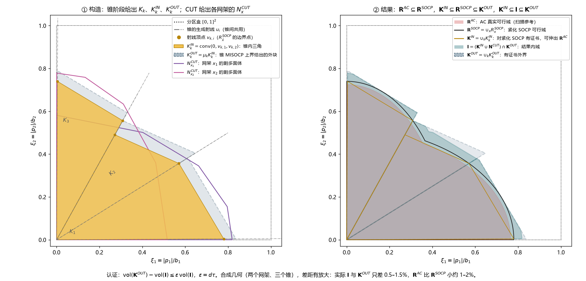

# 数学符号与代码变量契约

本文描述当前主线，即方法 RCUT：径向锥夹逼 R 加逐网架割平面 CUT。相同数学量必须保留登记名称、单位、索引、状态布局和结果键；不能通过删登记绕过检查。新增量先登记，语义或输出格式变化必须显式迁移并同步调用方与回归。

## 维数、索引与单位

| 数学量 | 固定名称 | 单位与形状 |
|---|---|---|
| 非根节点数、候选走廊数、型号数、功率维数 | `n / n_corridors / n_types / len(load_nodes)`，公式 `n/m/t/d` | `d=2/3`；真实节点 ID 不等于数组位置 |
| 建设向量 x | `choices[e,k]`、`x`、答案键 `x` | 二元 `(t,)`；唯一顺序为 `network.type_keys` |
| 走廊状态 z=Hx | `network.corridor_types @ x` | `(m,)`；H 为 `(m,t)` |
| 独立功率 p | `power`、`problem.power`、答案键 `p` | kW，`(d,)`；顺序为 `load_nodes` |
| 运行状态 y | `state` | `(3*t+n+2*m,)`；不含 SP 的 eta |
| 功率基值、电压基值 | `base / voltage_kv` | kVA / kV；不是自动等于电源容量 |
| 电阻、电抗 | `r / reactance` | p.u.，`(t,)`；电抗不得改名 x |
| 原始和固定负荷 | `original_p/original_q`、`fixed_p/fixed_q` | kW / kvar，`(n,)`；固定负荷的可调节点置零 |
| 无功比例 | `q_ratio` | q/p，无量纲；不是功率因数 |
| 电压限值 | `vmin / vmax` | 电压平方 p.u.²，`(n,)` |
| 送端有功上限 | `capacity` | p.u.，`(t,)`；不等于电流或视在功率上限 |
| 源端限值 | `source_pmax/source_qmax/source_smax` | p.u.，含线路损耗 |
| 独立负荷总量界 | `power_limit` | kW |
| 预算 | `budget`，费用 `cost_offset + cost @ x` | FourBus 为元；Case33 为开合次数 |

根不占 `nodes` 和 `state` 的电压元素，父节点哨兵为 -1。型号按走廊输入顺序展开，`type_slices/type_corridor` 表示型号和走廊之间的唯一映射。具名 `loads[i]` 使用真实节点 ID，数组使用 `load_nodes` 顺序。`required` 是必须接入节点掩码；`road_allowed` 限制可用走廊。

阻抗基值为 `voltage_kv**2/(base/1000)`。`Network.loads(power)` 返回标幺节点 p/q，形状 `(batch,n)`；单点也保留批次轴。FourBus 输入层 `r_ohm_km/x_ohm_km/capacity_kw/cable_cny_m` 在入口换算，不能直接当标幺量。

Case33 保留原 MATPOWER 线路与背景负荷，仅七条开关可变；相对初始状态的一次闭合或断开各计一次，预算 `switch_budget=7`。常闭开关成本系数为 -1，常开为 +1，`cost_offset` 补回初始常闭数。

Case33Plan（`--case case33plan`，网架名 case33bw_plan）是扩展规划算例，线路参数与背景负荷同 Case33：`Case33Plan.switches` 为可开断的既有线路 S1–S5（7-8、11-12、14-15、28-29、32-33，基态闭合，开断不计费）；`Case33Plan.candidates` 为基态不建的候选走廊 C1–C5（即原五条联络线 8-21、9-15、12-22、18-33、25-29，阻抗不变，相对建设费 4、4、4、1、1）；其余线路固定。预算为所建候选的建设费之和，`Case33Plan.plan_budget=14` 即全部候选都可建，共 87 个径向方案。两个算例共用 `_Case33bw._build`：按 MATPOWER 数据建网，`cost_offset=-c@x0` 使原始方案的费用为 0。

入口共同采用 `CURRENT_LIMIT=200` A（实验指定值，不是原数据额定值）。`Case33(current_limit=...)` 可显式传标量或 37 项数组，构造器默认 inf 保留。`ell_limit=(current_limit/I_base)**2`，`I_base=base/(sqrt(3)*voltage_kv)` A；型号及树上的 `ell_limit` 始终是标幺电流平方。主线与 AC/SOCP 参考使用同一限额。

## 拓扑与运行状态

`receiving/sending` 形状 `(n,m)`，receiving-sending 为关联矩阵，流入为正。`E` 为 `(n,d)` 的负荷嵌入矩阵。`active_nodes` 是接入二元变量，`MasterProblem.__init__.f` 是连通虚拟流，与电功率无关。拓扑约束为每走廊至多一型号、边两端接入、`Gf=a`、`-n*z<=f<=n*z`、边数等于接入非根节点数。

外部 `plan/choice/fixed_plan` 为“走廊 ID → 型号 ID 或 None”字典，通过 `encode_plan/decode_plan` 转换；`start` 是型号向量，`incumbent` 是带证书的答案字典。运行树只保存实际接入节点，`node_indices/type_indices` 回指全图，`parent/children/order/roots` 使用树局部索引；`D` 汇总下游节点。`direction=±1` 区分根向和参考方向。反向支路必须计损耗：`P=-P_tree+r*ell`，`Q=-Q_tree+reactance*ell`。

| 状态分块 | 唯一切片 | 单位 |
|---|---|---|
| P | `P_slice = [0:t]` | 参考送端有功 p.u. |
| Q | `Q_slice = [t:2*t]` | 参考送端无功 p.u. |
| ell | `ell_slice = [2*t:3*t]` | 电流平方 p.u.² |
| v | `v_slice = [3*t:3*t+n]` | 非根节点电压平方 p.u.² |
| s+、s- | `slack_slice = [3*t+n:3*t+n+2*m]` | 开断压降余量，先 plus 后 minus |

`operation.P/Q/ell/v/plus/minus` 与 `state` 是同一批变量的具名与扁平视图，根电压恒为 1。断线余量满足 `0<=s±<=drop_max*(1-z)`；未选型号功率和电流为零。全局 `y_lb_global/y_ub_global` 是割计算使用的有效盒，不替代完整运行约束。`pmin/pmax/qmin/qmax/ellmax` 是派生界，有限电流时 ellmax 同时受 ell_limit 限制。带符号模型允许源端反送。

当前约束由 `GridPhysics.add_operation` 装配；数学式中的 A/B/C 不对应另一套代码属性。SOCP 电流约束为 `P²+Q²<=u*ell`；独立 AC 改为等式，其余拓扑、预算、运行约束相同。

## MP、SP、联合割与 OBBT 紧化

MP2 最大化 `direction @ p`，`objective/bound` 是 kW 的可行值/全局上界；MP1 最小化费用，`objective/bound` 是费用值/全局下界。成功答案包含 `x/p/state`；明确不可行返回 None。`radial_gap_kw=1e-3` 只检查目标间隙，不改写功率。原始求解质量不合格或无可靠答案时停止，不修补或重求。

SP 固定 x,p 后最小化非负 `eta`（求解器名 violation），只允许功率平衡与压降等式 ±eta，其余约束保持严格。`max(eta,0)+MaxVio<=PLANNING_TOL` 才接受原始 `state`。正 eta 通过锥的必要支撑平面 LP 生成有效联合割；`score_only=True` 保存 `cone_normals` 并延迟至 `generate_cut` 取割。超时、数值失败或无法分离均不能作为不可行证书。

唯一联合割方向是 `alpha + beta @ p + delta @ x >= 0`，数组布局 `[alpha, *beta, *delta]`，长度 `1+d+t`；beta 作用于 kW（分区内为幅值 u）。`_separating_cut.dual` 按求解器线性行排列，`coefficients` 按变量索引，`h` 提取全部 state 列。采用 Gurobi 行乘子方向，固定 x/p 的等式乘子先置零：`alpha=-dual@rhs + max(h,0)@y_ub_global + min(h,0)@y_lb_global`。正比例归一化后截距加 `1e-10` 保守补偿。`calls/cut_calls` 分别计 SP 与取割 LP 次数。

方案紧化：方案首次使用时 `GridPhysics.obbt` 在独立功率 `[0,bounds]` 内对选中型号的 P/Q/ell 与节点 v 做 `OBBT_ROUNDS` 轮 OBBT，盒存于 `GridPhysics.boxes[tuple(x)]`，键 `(量名, 型号键或节点)`、标幺；端点外扩 `OBBT_PAD`，未证得最优的端点保留原界（首轮为全局界）。`add_operation(..., scheme=x)` 对已紧化方案追加盒约束与反向锥包络割 `u_L*ell+ell_L*u-u_L*ell_L <= (P_L+P_U)P-P_L*P_U+(Q_L+Q_U)Q-Q_L*Q_U+ENVELOPE_MARGIN`（另一条取 u_U、ell_U，u 为参考送端电压平方），每行右端加 `M*H(x)`：H 为 x 与该方案的汉明距离，M 为该行在全局界上的最大违反量，故联合割对全部 x 仍有效。SP、射线与割 LP 传入 scheme；锥 MISOCP 同时带全部已紧化方案的提升行。含紧化行的模型和 OBBT 用 `OBBT_CONV_TOL`。`obbt_extremes` 以 `settings.obbt_workers` 份模型副本并行求解，结果与串行逐位相同。

有限逐线路电流的 Port SP 固定使用既有 Gurobi 连续 SOCP；其他 Port SP 和射线使用 Clarabel。`solve_conic.basis/offset` 表示消元坐标，`cone_scale` 只是等价锥缩放。射线内域见证使用既有 `1e-6` 锥裕量，有限电流界同时扣除相同裕量；原物理残差仍按 `1e-8` 验收。`numeric_focus` 是求解设置，不改变数学可行性。

## 符号分区与几何坐标

主线只用符号分区：`PortPhysics.sign` 为 ±1 向量，内部非负幅值 u，真实 p=sign*u；负荷 PF=0.95、光伏 PF=1，允许反送。`main.mode=1` 只传给扫描接口（`vertify` 的缓存身份仍区分 mode）。输出、回放和扫描始终是真实 kW；割只在所属符号区有效，联合割在分区内共享。

`bounds=port_bounds(network)` 为公共正数坐标尺度 b（kW），内部点 `xi=u/bounds∈[0,1]^d` 无量纲；分区盒即 `[0,1]^d`。结果 `bound` 是查询目标的标量界，不能与 bounds 混用。叶锥、K^IN_k、N^CUT_x 与测度都在 xi 中计算，`build_partition` 返回前乘回 bounds 得 kW 幅值，`build_region` 再乘 sign 得带符号 kW。

`halfspaces/contains/clip_polytope` 不自动换算。面方程为 `F@xi+g<=0`；裁剪接口为 `constant+coefficient@xi>=0`。固定 x 的联合割在 xi 中为 `alpha+delta@x+(beta*bounds)@xi>=0`（`Cutting.clip`）。`covered` 先按包围盒筛点再逐行 `contains`，结果与逐行判定相同。`clip_box` 裁到 xi<=1（xi>=0 由锥保证），`cone_clip` 裁到锥 `U⁻¹xi>=0`，`box_vertices` 为分区盒顶点。

## 径向锥夹逼（R）

| 数学量 | 代码 | 单位与含义 |
|---|---|---|
| 方向 u_k | `Radial.directions`、`Radial.midpoints` | xi 中的单位向量，初始为坐标轴；棱 (a,b) 的中点方向由相邻锥共用，射线缓存随之共用 |
| 锥 K_k=cone(u_keys) | `Cone.keys`、`Radial.U` | d 个方向编号；U 的列为 u_i |
| x̂、y | `Cone.x`、`Cone.cover` | 内域网架；x̂ 原点不可行时的近端覆盖网架，可行时为 None |
| v_{k,i}、Q | `Cone.verts` | `(d,d)`，第 i 行 v_{k,i}=ρ_x̂(u_i)·u_i（xi），即 R^SOCP_x̂ 沿 u_i 的边界点；Q=verts.T |
| c | `Cone.c` | c=1ᵀQ⁻¹，锥内 xi=Σα_i v_i 时 Σα_i=c@xi |
| μ_k | `Cone.mu`、`Cone.inherited` | 外界因子：锥 MISOCP 的 ObjBound；未求解时沿用父锥 (c, μ_k) |
| K^IN_k、K^OUT_k | `Cone.halfspace`、`cone_outer` | K^IN_k=conv(0, v_{k,1..d})；K^OUT_k={xi∈K_k: c@xi<=μ_k}∩盒=μ_k·K^IN_k∩盒 ⊇ **R**^SOCP∩K_k |
| Δ_k | `Radial.delta` | (μ_k^d-1)·vol(K^IN_k)，xi^d |
| ΣΔ_k/Σvol(K^IN_k) | `Radial.volume_ratio` | 体积缺口比；尚无锥时为 inf |
| 射线与原点证书 | `Radial.rays`、`Radial.nears`、`Radial.origin` | 键 (方案, 方向编号)；远端点与近端点为 xi；原点认证为布尔 |

内域证书 `Radial.inner`：x̂ 原点可行时 K^IN_k ⊆ R^SOCP_x̂；否则需原点可行的 y 在每个生成方向的射线半径不小于 x̂ 的近端半径，K^IN_k ⊆ R^SOCP_x̂ ∪ R^SOCP_y。证书针对 OBBT 紧化 SOCP 模型，K^IN_k 不保证在 **R**^AC 内（松弛残余）。`Radial.vertex` 从原点朝分区盒边界点 `bounds*u/max(u)` 做紧化射线，半径小于 `MIN_RADIUS` 视为没有顶点；`Radial.near` 是从远端朝原点的反向射线。单次射线与原点 SP 的时限不超过 `RAY_SECONDS`。

外界 `cone_misocp`：x 自由的完整 MP（全部选型、拓扑、预算、运行约束），在 xi 上最大化 `objective`；`rows` 给锥约束 `rows@xi>=0` 与分区盒，缺省时为中心射线 xi_1=…=xi_d 并以 no-good 排除 `exclude`。全部已紧化方案的行按汉明距离提升，未紧化方案为纯 SOCP，故任何终止状态下的 ObjBound 都是 **R**^SOCP 在该锥上的有效上界；`CONE_CONV_TOL` 是它的 barrier 收敛容差。返回 `status/bound/x/point`（point 为 kW 幅值），尚无界时 bound=inf。`Radial.misocp` 是懒惰 OBBT：现任方案尚未紧化时先 OBBT 再重解，至多 `Radial.misocp.rounds` 轮（锥 MISOCP 不限；中心射线为 `LAZY_ROUNDS`）。单次时限 `settings.mip_seconds`，相对间隙 `settings.mip_gap`；中心射线求解用 mip_gap=0。

初始网架 `Radial.initial`：中心射线 MISOCP 的候选仍未紧化时，`Radial.farthest` 在已紧化、未排除的网架中取紧化中心射线（固定网架的 `ray_support`，朝 bounds）最远者；中心射线只用于选网架，其上界不进证书。胜出网架原点不可行时以 no-good 排除后重解。

`Radial.run(epsilon, check)` 用体积准则细分：每次取 Δ_k 最大的锥，ΣΔ_k<=ε·Σvol(K^IN_k) 或 `check()` 成立即 certified。`Radial.options` 给候选剖分：解点方向的锥坐标 λ 全部 >= `SPLIT_MARGIN` 时星形剖分；三维恰有一个 λ 偏小时在对边上按 λ 投影二分；最后总有最长棱中点二分。`Radial.split` 的子锥 x̂ 取 {父 x̂, 解的方案, 父覆盖网架} 中证书成立、半径乘积最大者。锥角直径小于 `settings.min_width`、叶锥数达到 `settings.max_cones` 或没有内域证书的锥记 unresolved，不再细分。`Cone.status` 为 pending / bounded / unresolved；`Radial.run` 返回 certified / unresolved / time_limit，可续跑，阶段时限到达抛出 RegionTimeout 后保留已得证书。`Radial.schemes` 是 X*，即可能改变 **I** 的网架：先取叶锥的 x̂（按所占锥体积从大到小），再接各叶锥的覆盖网架与锥 MISOCP 解点网架（按所在锥的 Δ_k 从大到小）；只做过 OBBT 或原点测试的网架不在其中。

## 逐网架割平面（CUT）

| 数学量 | 代码 | 单位与含义 |
|---|---|---|
| N^CUT_x | `Cutting.networks`（方案 → `Cutting.cut:vertices` / `Cutting.cut:status` / `Cutting.cut:version`） | 固定方案 x 的割平面多面体（xi）：conv(**K**^OUT)∩盒被分区内共享的联合割裁剪，N^CUT_x ⊇ R^SOCP_x；version 在其他网架的新割裁剪它时加一 |
| 共享割 | `Cutting.cuts`、`Cutting.count` | 布局 `[alpha, *beta, *delta]`，beta 作用于幅值 u（kW）；count 为分区内割序号 |
| area_ratio | `Cutting.cut.history` | 每次割掉的体积 / 割前 vol(N^CUT_x) |
| threshold、patience | `settings.threshold / settings.patience`，`stagnated` | 连续 patience 次 area_ratio < threshold 即停滞；等于 threshold 不算小割 |
| point_tol | `settings.point_tol`，`register_power` | kW 最大坐标差内视为同一 SP 评分点，不移动代表点 |
| 计入内域的状态 | `CUT_ACCEPTED` | stagnated / exact / empty；empty 即 N^CUT_x=∅ |
| 夹逼间隙 | `Cutting.gap`、`Cutting.measures`、`Cutting.epsilon` | vol(**K**^OUT)/vol(**I**)-1（**I** 为空时 inf）；sandwich 的逐锥测度缓存；ε=d·tau |
| 不再割的网架 | `Cutting.declined`、`GAP_SHARE` | 某轮 CUT 中一个网架使间隙下降不足 GAP_SHARE·ε 时，本轮其余网架记入 declined |

`Cutting.cut` 的一次循环：N^CUT_x 从 conv(**K**^OUT)∩盒出发（**K**^OUT ⊇ **R**^SOCP ⊇ R^SOCP_x，割的有效性不变），先被已有割裁剪；SP（固定 x，带该网架的 OBBT 盒与包络行，`score_only=True`）为 N^CUT_x 的每个顶点评分，η 最大的待割顶点由 `generate_cut` 取联合割裁剪 N^CUT_x，直到停滞（stagnated）、全部顶点可行（exact）或 N^CUT_x 为空（empty）。其余终态不计入内域：时间片用完（slice）、该点数值失败（failed）、顶点都已取过割却仍不可行（point_resolution）、本轮未及开始（skipped，下一轮重试）。`cache/powers/applied/failed/fresh` 是该循环的局部状态：SP 答案缓存、评分点代表、已取割的点、数值失败的点、本循环的新割。循环结束后新割裁剪本分区其他网架的 N^CUT_x（割对全部可行点有效）。

`Cutting.run` 是一轮 CUT：间隙已达 ε 时不割；否则未割过或上轮 skipped、且不在 declined 中的网架按 X* 次序排队，每割完一个求 `Cutting.gap`，已达 ε 或降幅不足 `GAP_SHARE`·ε 即结束本轮，本轮其余网架记入 declined、之后不再割。本轮最多用分区剩余时间的 `PASS_SHARE`，单个网架不超过 `CUT_SECONDS`；`CutSlice` 表示一个网架的时间片用完。N^CUT_x 是 R^SOCP_x 的外近似，RCUT 把停滞的 N^CUT_x 当作该网架的可行域，不作内域认证。

结果内域 **I**=(**K**^IN ∪ **N**^CUT)∩**K**^OUT，`sandwich` 返回 (vol(**I**), vol(**K**^OUT))，单位 xi^d：二维为 shapely 并集；三维按叶锥分解（叶锥内部互不相交），每锥的并集体积按 (锥几何, 相交 N^CUT_x 的版本键 `Cutting.sets`) 缓存，并集数值失败时只计 K^IN_k（内域只会低估）。`piece` 是 N^CUT_x 与 K^OUT_k 之交，零体积时为空。分区认证 `build_partition.certified`：vol(**K**^OUT)-vol(**I**)<=ε·vol(**I**)，ε=d·tau；或锥部分自身满足 ΣΔ_k<=ε·Σvol(K^IN_k)。

## 区域与符号

上标写物理含义，下标写序号（锥 k、网架 x）；单个锥或网架的集合不加粗，并集加粗。K 与锥相关，N 与网架相关，R 为真实可行域。

| 含义 | 符号 | LaTeX | 代码 | 关系 |
|---|---|---|---|---|
| AC 真实可行域 | **R**^AC | `\mathbf{R}^{\mathrm{AC}}` | 扫描参考 `states` | 不显式求 |
| 网架 x 的 OBBT 紧化 SOCP 可行集（凸） | R^SOCP_x | `R^{\mathrm{SOCP}}_x` | 不显式求 | |
| 全部网架的紧化可行域 | **R**^SOCP=∪R^SOCP_x | `\mathbf{R}^{\mathrm{SOCP}}` | 不显式求 | **R**^AC ⊆ **R**^SOCP |
| 第 k 个锥、射线顶点 | K_k、v_{k,i} | `K_k`、`v_{k,i}` | `Cone.keys`、`Cone.verts` | v_{k,i} 在 R^SOCP_x̂ 的边界上 |
| 锥 k 的内三角（对紧化模型有证书） | K^IN_k=conv(0, v_{k,1..d}) | `K^{\mathrm{IN}}_k` | `Cone.verts` | K^IN_k ⊆ **R**^SOCP |
| 锥内域并集 | **K**^IN=∪K^IN_k | `\mathbf{K}^{\mathrm{IN}}` | `Radial.geometry` | **K**^IN ⊆ **R**^SOCP |
| 锥 k 的外界因子与外块 | μ_k、K^OUT_k=μ_k·K^IN_k∩盒 | `\mu_k`、`K^{\mathrm{OUT}}_k` | `Cone.mu`、`cone_outer` | **R**^SOCP∩K_k ⊆ K^OUT_k |
| 锥外界并集（有证书外界） | **K**^OUT=∪K^OUT_k | `\mathbf{K}^{\mathrm{OUT}}` | `build_partition:outer` | **R**^SOCP ⊆ **K**^OUT |
| 网架 x 的割多面体 | N^CUT_x | `N^{\mathrm{CUT}}_x` | `Cutting.cut:vertices` | R^SOCP_x ⊆ N^CUT_x |
| 计入的割多面体并集 | **N**^CUT=∪N^CUT_x | `\mathbf{N}^{\mathrm{CUT}}` | `Cutting.sets` | 停滞、精确或为空的 N^CUT_x |
| 结果内域 | **I**=(**K**^IN ∪ **N**^CUT)∩**K**^OUT | `\mathbf{I}` | `build_partition:inner` | **K**^IN ⊆ **I** ⊆ **K**^OUT |
| 锥 k 的体积缺口 | Δ_k=(μ_k^d-1)·vol(K^IN_k) | `\Delta_k` | `Radial.delta` | 决定细分哪个锥 |

关系：**R**^AC ⊆ **R**^SOCP，**K**^IN ⊆ **R**^SOCP ⊆ **K**^OUT，R^SOCP_x ⊆ N^CUT_x，**K**^IN ⊆ **I** ⊆ **K**^OUT。认证 vol(**K**^OUT)-vol(**I**) <= ε·vol(**I**) 表示结果内域已与有证书外界贴合到 ε 以内。K^IN_k 的证书针对紧化 SOCP，可能含 AC 不可行的格：Case33 二维正式结果中锥内三角含 123 个 AC 不可行格（全部 SOCP 可行），结果内域的 158 个多余格中其余 35 个来自 **N**^CUT 的外壳。

旧符号对照：T→K^IN_k，I_R→**K**^IN，O、μ̄→K^OUT_k、μ_k，O_R→**K**^OUT，N_x→N^CUT_x，R_x→R^SOCP_x，R→**R**^SOCP，AC→**R**^AC，I→**I**。代码变量名不变。示意图为合成几何（两个网架、三个锥），各集合的差距有放大。

## 分区流程、并行与结果

`build_partition` 依次为：A 阶段 `Radial.run(settings.discovery_eps)`，时限为分区时限的 `settings.discovery_share`；若体积缺口比仍大于 ε，CUT 割 X*；A+ 续跑 `Radial.run(ε, check)`，每次锥决策后先割新出现的网架，再检查夹逼判据。返回分区摘要：

| 键 | 含义 |
|---|---|
| `build_partition:sign / status / certified` | 分区符号；certified / unresolved / time_limit；是否获证 |
| `build_partition:how` | radial（锥部分自身满足体积准则）或 cut（夹逼判据） |
| `build_partition:seconds / gap / volume_ratio` | 分区墙钟秒；vol(**K**^OUT)/vol(**I**)-1；ΣΔ_k/Σvol(K^IN_k) |
| `build_partition:cones / networks / accepted / cuts` | 叶锥数；做过 CUT 的网架数；其中计入内域的数目；割数 |
| `build_partition:inner / outer` | **I** 的块（各 K^IN_k 与按锥裁到 K^OUT_k 的 N^CUT_x）与 **K**^OUT 的块（各 K^OUT_k，尚无锥时为分区盒）的顶点，kW 幅值 |

`build_region` 为每个分区起一个 spawn 子进程（`_partition`），并发数 min(`workers`, 2^d)，`settings.workers=workers`；OBBT 的线程数为 workers // 仍在计算的分区数，计数由主进程在通道中维护（提交分区时加一、收到结束标记时减一），子进程经 `RunMonitor.running` 读取，主进程内直接构域时为 1；后启动的分区得到剩余时间按并发比例的份额，总时限为 `seconds`。子进程的 `RunMonitor(sign=...)` 经 `_connect` 设置的通道发送事件，主进程 `RunMonitor.share` 建立通道、`RunMonitor.forward` 转发、`RunMonitor.close` 发送结束标记；主进程中断时置取消信号并读空队列。结果 `inner/outer` 为带符号 kW 的 `[dict(vertices, sign)]`，`build_region:axis_lower/axis_bounds` 为外域顶点的范围，`build_region:partitions` 为各分区摘要（去掉 inner/outer），另含 status/certified/timing。

## 独立扫描、结果与回放

`vertify.py` 是独立 AC/SOCP 扫描入口。`ac_network` 复制完整配置，不删除限流。`budget_schemes` 仅供小算例独立 AC 参考的拓扑审计，构域不调用它。AC 单树只提供可行见证；全拓扑必要条件排除或完整 AC 不可行证书才给负标签。迭代失败、超时和未知均不可当作不可行：`scan_line` 中求解失败、超时或可行解质量超过 `SCAN_TOL` 的点保持未决（0），扫描继续。`SCAN_TOL`（1e-6，Gurobi 默认可行性容差）是扫描接受可行解的质量门槛：SOCP 为 MaxVio+η，AC 另用潮流方程复核残差与运行界（`MasterProblem.solve.tolerance` 传入同一门槛）；不可行判定（η 的下界超过 PLANNING_TOL、已证不可行）不变。它只决定原先给不出标签的点，已有标签不变，故不进入缓存身份。

`ACPowerFlow` 接收运行树，state(power,ell) 返回 `(P,Q,v,u)`，均为 `(batch,n_tree)`，v/u 为受端/送端电压平方。内部 `_state.p/q` 是节点标幺负荷；AC 残差为 `P²+Q²-u*ell`。

`AC_CACHE_METHOD=ac_socp_grid_v4`，`ac_identity` 包含物理参数、ell_limit、模式、功率因数、有序节点和预算，不含构域 tau、时间和线程。`reference_box` 用同配置完整 SOCP 的方向全局上界覆盖两种参考。`scan_problem/scan_line` 逐点独立求解；SOCP 固定点使用 eta 目标，接受与排除依赖原门槛；AC 不读取 SOCP 标签。`main.run` 的扫描框为 reference_box 与结果外域范围的并。

| 缓存字段 | 固定含义 |
|---|---|
| `axis_lower / bounds` | 真实 kW 扫描边界 `(d,)` |
| `origin / step / start` | kW 原点/步长、整数起始索引；点为 `origin+(start+index+0.5)*step` |
| `states / witness_x / residual` | AC 标签、型号见证、残差；形状分别 `(n1,...,nd)`、`(n1,...,nd,t)`、`(n1,...,nd)` |
| `socp_states / socp_witness_x / socp_residual` | 同坐标 SOCP 的独立结果，形状同上 |
| `1 / -1 / 0` | 可行 / 已证不可行 / 未决；未决格不计入对应参考的误差率，另计格数 |
| `cache_path` | 实际 NPZ 路径；归档记录可使用相对项目根目录的路径 |

`scan_path` 给出 `results/scan/<网络>/<节点>/<身份>/`，`region_path` 由 origin/step/start/shape 生成区域摘要。扩界保留格点，部分覆盖只补算缺点；AC/SOCP 分别补零标签。`import_ac_reference` 仅接受同版本同身份数据。`force_rescan` 先备份；主进程每 `SAVE_SECONDS` 至多原子落盘一次，结束或中断时必落盘，独占锁避免并发覆盖。

`RunMonitor.validation` 只接受配对的 AC/SOCP 参考：比较使用最终 inner 作为计算域，另保留 outer 指标；未决格不计入，`RunMonitor.validation:undecided_cells / socp_undecided_cells` 为 AC/SOCP 未决格数，`RunMonitor.validation:computed_states` 为内域在格心上的掩码。`comparison_metrics` 的 MR=`missed/reference`、FR=`extra/computed`，百分数，空分母 None；同时保留 missed_cells/extra_cells/reference_cells/computed_cells。`comparisons` 键为 result_ac/result_socp/socp_ac。导出版本 paired_scan_v2，NPZ 的 power 为 `(N,d)` kW，ac_states/socp_states/inner/outer 对应同坐标；CSV 标签列为 ac_state/socp_state。网格误差不是连续体积证明。RCUT 的 **I** 含 **N**^CUT 外近似，相对 AC 的 FR 是外侧估计误差。

回放 version=4：history 保存增量过程，validation_state 保存最终扫描。子进程事件为 phase_start、step、cone、network、point、cut、partition_end，主进程另有 start、region_end；N^CUT_x 每个顶点的 SP 评分是一个 point 帧，取割是一个 cut 帧；η、可行与否、割掉比例与连续小割数都在 step 中。`RunMonitor.frame` 从每 `FRAME_STRIDE` 帧一份的快照 `RunMonitor.snapshots` 向后合并。`MERGED` 中的 schemes/cones/cut_history 按键增量合并，键带分区前缀 `<分区>:`（如 `+-:3`），坐标在 `signed_values` 中乘 sign：

| 状态 | 行内容 |
|---|---|
| `cones` | `Radial.publish:inner / outer / scheme / mu`：K^IN_k 与 K^OUT_k 的顶点、x̂ 标签、μ_k；被细分的父锥置 None |
| `schemes` | `Cutting.row:x / choice / cost / outer / status` 与 sign：outer 为 N^CUT_x，状态在 CUT_ACCEPTED 中时计入 **I**（monitor 的 `accepted`） |
| `cut_history` | 割 `cut`（布局同联合割，beta 已乘 sign）、来源网架 `scheme`、`sign` |

`cone` 帧另有 volume_ratio（ΣΔ_k/Σvol(K^IN_k)）；`cut` 帧另有 schemes 与 cut_history。

判据步（check）与分区结束步（end）另带数值 `gap`（夹逼间隙，**I** 为空时为 null）。每次求解或判定在其完成时记为一帧的 `step`（`Radial.step:kind / text`，几何为 kW 幅值的点 `p` 与折线 `vertices`、点所属网架 `scheme`，`forward` 乘 sign 并给 scheme 加分区前缀；`step` 不在 MERGED 中，帧状态保留最近一次）。kind 依流程为：center（中心射线，max Σξ；候选未紧化时其后各条候选射线为 ray 步）、obbt、origin（p=0 的 SP）、ray（射线 max t，线段 0→v）、near（反向射线，线段远端→近端）、root（根锥 K_0）、cone（锥 MISOCP max c·ξ，点为解点 ξ*，折线为 K^OUT_k 的远端面 μ_k·v_{k,i}，`Radial.far_face`）、lazy（`Radial.misocp` 的懒惰 OBBT 一轮：x 自由 MISOCP 的现任网架尚未紧化，附当前上界与现任解点，随后 OBBT 并重解）、split（细分 Δ_k 最大的锥）、network（开始割网架 x）、sp（顶点评分 min η，附 feasible）、cut（取割）、network_end、check（夹逼判据）、end（分区结束）。

收敛过程：`convergence` 由一份回放与其校验扫描网格求各分区夹逼间隙随时间（分区尚无计入 **I** 的 N^CUT_x 时 **I**=**K**^IN，由锥行体积直接求；之后取判据步的 gap），以及全部分区内域相对 AC 的 MR/FR 随时间（按 `CONVERGENCE_SAMPLES` 个等分时刻采样，只重算变化过的分区），返回 `convergence:time / mr / fr / gaps / ends`。`draw_convergence` 把多次运行画在同一张图上，`main.py --convergence 记录…`（`convergence_figure`）输出 `<案例>_<节点>_convergence.png` 到各运行目录的公共上级。

窗口：A 是全部分区的全局总图，坐标 `NativeWindow.limits` 由 `NativeWindow._fit_limits` 取最新帧全部 K^OUT_k 的范围（两侧各 10%；可勾选取整个分区盒）；回放时即最终外界、全程不变，实时运行中只在内容超出或某一维缩到范围的 `FIT_SHRINK` 以下时重设。网架面板取其中本分区所在的卦限，新网架追加在末页、默认不跟随当前网架。`NativeWindow._draw_steps` 在 A 上画所选分区最近 `STEP_TRAIL` 个步骤（plot.py 的 `STEP_STYLE` 给标记、颜色与短标签；坐标外的点贴边画空心），网架面板只画当前步骤中属于本网架的点，并描出当前帧新建或求界的锥与切割中的 N^CUT_x；步骤栏列出 `STEP_LOG` 行，点击跳转。“逐步跟踪”选定分区后，上一步/下一步、上一割/下一割与播放只停在该分区的帧（`NativeWindow.frame_meta` 记各帧的分区、事件与是否步骤）。校验面板是逐格对比：参考可行格为浅色（三维画其表面），遗漏格红色、多余格橙色，可在计算域—AC、计算域—SOCP、SOCP—AC 之间切换。仅当前帧之前的锥、网架、割与点出现在过程图；最终扫描独立显示。result 包含 status/certified/inner/outer/partitions/timing，分区证书在 partition_end；数值未决和时限未完不能改成 certified。JSON 非有限值为 null，仅预算 null 可按 inf 解释。

## 方法归档

方法对照实验的精选运行归档在 `results/methods/<算例>/<方法>/workers_<w>/run_<r>/`（summary.json、metrics.json、timeline.csv、solves.csv.gz、snapshots/final.json.gz），登记于 `results/manifest.json` 的 `method_archive`、`runs`、`files`；本分支只保留 RCUT 的运行（阈值 1% 与 0.5%、2% 敏感性），R、H、RB、RCUT2 的运行与汇总报告在 tag `results-methods-v1`；各方法的代码版本由 tag `method-<方法>-v1` 固定。主线分支 main 为方法 RCUT（与分支 method-RCUT 同源）；方法 RB 的主线实现在分支 method-RB。

## 容差与默认设置

| 配置 | 当前值 |
|---|---|
| `PLANNING_TOL / GEOMETRY_TOL` | 各 1e-8；物理残差/归一化几何门槛，语义独立 |
| `OBBT_ROUNDS / OBBT_PAD / ENVELOPE_MARGIN / OBBT_CONV_TOL` | 2 / 1e-6 标幺 / 1e-4 标幺² / 1e-8 |
| `CONE_CONV_TOL` | 1e-6；锥 MISOCP 的 barrier 收敛容差 |
| `AC_TOL / FIXED_POINT_TOL / SCAN_TOL` | 1e-9 / 1e-12 / 1e-6；SCAN_TOL 只用于参考扫描接受可行解 |
| `REGION_TAU` | 0.005；体积目标 ε=d·tau，不是物理容差 |
| `NETWORK / DIMENSION / mode` | Case33 / 3 / 1 |
| `CASE_TIME_LIMIT / WORKERS / SOLVER_THREADS` | 300 秒 / 16 / 1；总时限不含事后扫描 |
| `DISCOVERY_EPS / DISCOVERY_SHARE` | 0.15 / 0.25 |
| `MIP_SECONDS / MIP_GAP` | 60 秒 / 1e-3 |
| `MIN_WIDTH / MAX_CONES` | {2:1e-4, 3:2e-3} rad / {2:256, 3:2048} |
| `SPLIT_MARGIN / MIN_RADIUS / RAY_SECONDS` | 0.05 / 1e-9（xi）/ 30 秒 |
| `CUT_THRESHOLD / CUT_PATIENCE / POINT_TOL` | 0.01 / 3 / 0.01 kW |
| `CUT_SECONDS / PASS_SHARE` | 30 秒 / 0.75 |
| `GAP_SHARE / LAZY_ROUNDS` | 0.1 / 2；一轮 CUT 的间隙降幅门槛（乘 ε）；中心射线至多紧化的现任网架数 |
| `DIVISIONS / SCAN_DIVISIONS / SCAN_WORKERS / SAVE_SECONDS` | 160 / {2:160,3:80} / 20 / 30 秒；每扫描进程一个求解线程 |
| `FRAME_STRIDE` | 64 帧；回放状态快照间隔 |
| `STEP_TRAIL / STEP_LOG / FIT_SHRINK` | 6 / 8 / 0.6；主图保留的步骤数、步骤栏行数、主图收紧坐标的比例 |

单次 MP/SP 的时限仍用 MP_TIME_LIMIT/SP_TIME_LIMIT，扫描单点 60 秒；AC_ITERATIONS 为 AC 见证的迭代次数。不得合并不同语义的容差。数值配置变化须同步本表和结果协议。

## 显式迁移（2026-10-02：新算例 Case33Plan 与收敛过程图）

- 网架：Case33 的建网代码移入基类 `_Case33bw._build`（Case33 的数据与网架指纹不变，原扫描缓存继续可用）；新增 `Case33Plan`。`main.py` 的算例表改为 `CASES`（算例键 → 网架类、预算、三维节点）。
- 记录：判据步与分区结束步增加数值 `gap`，旧记录没有该字段，收敛图中计入 N^CUT_x 之后的间隙不可得。
- 新增 `vertify.convergence`、`plot.draw_convergence` 与 `main.py --convergence`。

## 显式迁移（2026-10-02：RCUT 吸收五项改动，模块各司其职）

对照实验 G12345 成为主线，方法名仍为 RCUT（实验脚本已删除，二维 60 s 对照运行在被 git 忽略的 results/rcut_variants）：

- 一轮 CUT 按夹逼间隙结束：`Cutting.run` 每割完一个网架求 `Cutting.gap`，已达 ε 或降幅不足 `GAP_SHARE`·ε 即结束本轮，其余网架记入 `Cutting.declined`；间隙已达 ε 时不开始新一轮。分区判据 `build_partition.certified` 与汇总的 gap 都用 `Cutting.gap`。
- X* 只取叶锥相关网架（`Radial.schemes`），`Radial.incumbents` 删除。
- N^CUT_x 从 conv(**K**^OUT)∩盒出发（原为分区盒）。
- 中心射线的懒惰 OBBT 至多 `LAZY_ROUNDS` 轮（`Radial.misocp` 增加 rounds），候选未紧化时 `Radial.farthest` 在已紧化网架中取中心射线最远者。
- OBBT 线程数由固定的 `settings.obbt_workers=workers//2^d` 改为 `settings.workers // RunMonitor.running()`；`RunMonitor.share` 的通道增加仍在计算的分区数。
- 记录精简：删除 `global_point`、`sp_point`、`eta`、`feasible`、`area_ratio`、`small_cuts`、`patience`、`cone_count` 与 `Cutting.row:inner`；过程点并入 step 的 `p` 与 `scheme`，计入 **I** 由网架状态判定。窗口不再单列 MISOCP 解点与 SP 点，坐标并入步骤说明。
- 模块分工：plot.py 只画图，原有的三维并集测度 `union_volume`、`_clip_face` 移入 region.py；monitor.py 的 `_union` 移入 region.py 为 `polygon_union`；monitor.py 的绘图基元与配色移入 plot.py 并改为公开名：`_cut_segment`→`cut_segment`、`_cut_polygon`→`cut_polygon`、`_hull_geometry`→`hull_geometry`、`_draw_3d`→`draw_3d`、`_voxel_faces`→`voxel_faces`、`_cap`→`cap`、`_draw`→`draw_geometry`，`STEP_STYLE` 与配色常数同移。
- 结果：results/mainline 的二维、三维归档为新主线运行（扫描缓存 region_f629fae70ed82ac4.npz 与 region_22dea14fe7af0414.npz，网格随外域扩为 161×170 与 142×179×116）。

## 显式迁移（2026-10-02：回放逐步标注与全局主图）

- 事件：新增 step 事件与各帧的 `step` 字段（`Radial.step`，`Radial.publish` 增加 step 参数；懒惰 OBBT 每轮记一步 lazy）；N^CUT_x 顶点的 SP 评分恢复为 point 帧。帧数随之增加（每次射线、OBBT、原点 SP 与顶点评分各一帧），旧录制仍可回放，只是没有步骤说明。
- 窗口：A 改为全部分区的全局总图，坐标取稳定范围（`NativeWindow._fit_limits`），取消右上角总览与“主图展开全局”（`NativeWindow._draw_overview`、`refresh_extent`、`_in_partition` 删除，`_boxes`、`_regions`、`_markers` 去掉分区参数）；网架面板的坐标由分区盒改为主图范围在本分区卦限中的部分，页面默认不再跟随当前网架；B、C 改为右侧两个标签页；“上一帧/下一帧”改为“上一步/下一步”。

## 显式迁移（2026-10-02：扫描未决、回放提速与精简）

- 扫描：`scan_line` 的数值失败与超时不再中止整次扫描，该点保持未决；可行解的质量门槛由 PLANNING_TOL 放宽为 `SCAN_TOL`（`MasterProblem.solve` 增加 tolerance 参数，默认仍为 PLANNING_TOL）。Case33 三维 80³ 网格原有 5 个 SOCP 未决格，其中两格 AC 可行、SOCP 解的 MaxVio 为 4.8e-8 与 3e-7，现标为可行。
- 校验：`RunMonitor.validation` 不再因未决格报错，未决格不计入对应参考并另计格数；参考必须含 socp_states，三组对比总会给出。`export_comparison` 不再要求 AC 标签完整，摘要增加 ac_undecided/socp_undecided。
- 回放：只读 version=4；RCUT 的 point 事件取消，取割顶点的 η 并入 cut 帧；`RunMonitor.frame` 改为快照加增量合并；三维凸域合成一个集合绘制并缓存凸包与面片；总览只画外包络；未变化的网架面板不重画；校验面板统一为逐格对比（遗漏红、多余橙），去掉逐块绘制多边形的三维校验图。
- 删除没有调用方的接口：`ACPowerFlow.classify`、`global_status`、`_build_global`、`violation`、`close` 与 `threads` 参数，`GLOBAL_AC_TOL`、`AC_TIME_LIMIT`（只服务于这套交叉核验，扫描不调用），`Network.incidence`、`OperatingTree.ppc`、`RunMonitor.remaining`；相应测试（tests/test_vertify.py 等）一并删除。
- 结果：`results/methods` 只保留 RCUT 的运行，其余方法的运行与报告移入 manifest 的 retired，保存在 tag `results-methods-v1`。

## 显式迁移（2026-10-02：RCUT 成为主线）

主线算法由逐网架顺序构域加完整物理查漏，改为 R + CUT。退役接口及其登记保存在 tag `mainline-sequential-v1`（3c061a2），对应关系如下：

- 构域：`build_sequential_region` 及其局部量（cache/powers/applied/initialized/counts/small_cuts/area_ratio/point_tol/ray_threshold 等）、`RegionState`、`stage_candidates`、`ray_gain`、`coverage_halfspaces` 由 `Radial`（全局搜索与外界）和 `Cutting`（逐网架 N_x）代替；割循环的 SP 评分、取割与停滞规则不变，局部状态现属 `Cutting.cut`，area_ratio 的序列为 `Cutting.cut.history`。主线不再做割后补射线与边界补充，`RAY_THRESHOLD` 无对应量。
- 全局覆盖：`remaining_search`、`RemainingRegionModel`、`COVERAGE_TOL`、`RESIDUAL_TIME_LIMIT`、`GridPhysics.center` 由 x 自由的锥 MISOCP `cone_misocp` 给出的外界 **K**^OUT 与体积准则代替；`MasterProblem.__init__.cuts` 随之去掉，MP 不再携带联合割。
- 时限与并行：`PARTITION_TIME_LIMIT`、`build_region.partition_seconds`、`run.partition_seconds` 由分区并行共享总时限 `build_region.seconds` 代替；`OBBT_WORKERS`、`run.obbt_workers`、`build_region.obbt_workers` 由 `WORKERS` 推出 `settings.obbt_workers=max(1, WORKERS//2^d)`。
- 默认值：`CUT_THRESHOLD` 语义不变，由 0.02 改为 0.01（方法对照的 RCUT 设置）；`SOLVER_THREADS` 由 20 改为 1（分区已并行）。主入口去掉 mode=0 非负负荷与 `--mode` 参数。
- 回放：version=4 格式不变，事件改为本文所列；`RunMonitor._geometry`、`global_end`、`partition_frame`、`seed`、`sp_start`、`updated` 由子进程事件与 `RunMonitor.forward` 代替。网架行增加 status，键带分区前缀。旧主线记录只能用 `mainline-sequential-v1` 的前端回放。
- 实验：`experiments/` 下支持面认证、径向夹逼与方案二对照（compare_plan2、plan2_geometry）的代码及登记保存在 tag `results-methods-v1`（ed379fb）与各 `method-<方法>-v1`；旧主线、支持面与径向夹逼的结果归档也在这些 tag 中，主线分支只保留方法对照归档 `results/methods` 与 Case33 参考扫描。

## 2026-09-30 整理的显式迁移

结果统一在 results/mainline、results/support_face、results/scan；映射、原路径、文件哈希和来源见 results/manifest.json。Case33 记录的 cache_path/ac_cache 改为相对项目根目录的 results/scan 路径，main.run 同步解析；求解数据和扫描数组不变。FourBus 已保存参考仍为历史 SOCP 格点，不能冒充当前配对 AC/SOCP 缓存。

退役内容为 Concept5、load_jiangkou/Jiangkou、legacy_case33 升级夹具、fixed_topology/upgrade_plan/affordable_designs/dispatch_state 测试辅助、旧前端测试和一次性数值诊断脚本。其登记随接口退役归档于 Git 提交 e79f18b。

交付运行 `python -m unittest tests.test_notation -v`；算法修改另跑相关数值回归。

## 当前登记接口索引

以下登记当前全部现存接口，以便名称检查覆盖字段、形参和结果键。`作用域.名称` 表示字段或局部量，`函数:键` 表示返回字典键；语义按上文分组约定。

### Network/case33bw.py

- [CURRENT_LIMIT](../Network/case33bw.py)、[Case33](../Network/case33bw.py)、[Case33.__init__.current_limit](../Network/case33bw.py)、[Case33.switch_budget](../Network/case33bw.py)
- [LOAD_NODES](../Network/case33bw.py)、[Case33Plan](../Network/case33bw.py)、[Case33Plan.switches](../Network/case33bw.py)、[Case33Plan.candidates](../Network/case33bw.py)
- [Case33Plan.plan_budget](../Network/case33bw.py)、[_Case33bw](../Network/case33bw.py)、[_Case33bw._build](../Network/case33bw.py)、[_Case33bw._build.price](../Network/case33bw.py)

### vertify.py

- [ACPowerFlow](../vertify.py)、[ACPowerFlow._state.p](../vertify.py)、[ACPowerFlow._state.q](../vertify.py)、[AC_CACHE_METHOD](../vertify.py)
- [AC_ITERATIONS](../vertify.py)、[AC_TOL](../vertify.py)、[FIXED_POINT_TOL](../vertify.py)、[SCAN_TOL](../vertify.py)
- [SCAN_FIELDS](../vertify.py)、[ac_identity](../vertify.py)
- [ac_interval_possible](../vertify.py)、[ac_network](../vertify.py)、[ac_scan_line](../vertify.py)、[ac_scan_line:residual](../vertify.py)
- [ac_scan_line:witness_x](../vertify.py)、[budget_schemes](../vertify.py)、[export_comparison](../vertify.py)、[import_ac_reference](../vertify.py)
- [reference_box](../vertify.py)、[region_path](../vertify.py)、[save_scan](../vertify.py)、[scan_ac_reference](../vertify.py)
- [scan_ac_reference.origin](../vertify.py)、[scan_ac_reference.start](../vertify.py)、[scan_ac_reference.states](../vertify.py)、[scan_ac_reference.step](../vertify.py)
- [scan_line](../vertify.py)、[scan_path](../vertify.py)、[scan_problem](../vertify.py)、[scan_problem.eta](../vertify.py)
- [signed_ac_witness](../vertify.py)、[SAVE_SECONDS](../vertify.py)、[CONVERGENCE_SAMPLES](../vertify.py)、[convergence](../vertify.py)
- [convergence:time](../vertify.py)、[convergence:mr](../vertify.py)、[convergence:fr](../vertify.py)、[convergence:gaps](../vertify.py)
- [convergence:ends](../vertify.py)

### monitor.py

- [COMPARISONS](../monitor.py)、[MERGED](../monitor.py)、[RegionTimeout](../monitor.py)、[RunMonitor](../monitor.py)
- [RunMonitor.__init__.sign](../monitor.py)、[RunMonitor.label](../monitor.py)、[RunMonitor.channel](../monitor.py)、[RunMonitor.shared](../monitor.py)
- [RunMonitor.share](../monitor.py)、[RunMonitor.close](../monitor.py)、[RunMonitor.forward](../monitor.py)、[RunMonitor.forward.label](../monitor.py)
- [RunMonitor.validation](../monitor.py)、[RunMonitor.validation.region_key](../monitor.py)、[RunMonitor.validation:comparisons](../monitor.py)、[RunMonitor.validation:metrics](../monitor.py)
- [RunMonitor.validation:undecided_cells](../monitor.py)、[RunMonitor.validation:socp_undecided_cells](../monitor.py)、[RunMonitor.validation:computed_states](../monitor.py)、[RunMonitor.snapshots](../monitor.py)
- [RunMonitor.frame](../monitor.py)、[FRAME_STRIDE](../monitor.py)、[STEP_TRAIL](../monitor.py)、[RunMonitor.running](../monitor.py)
- [STEP_LOG](../monitor.py)、[FIT_SHRINK](../monitor.py)、[ALL_PARTITIONS](../monitor.py)、[NativeWindow](../monitor.py)
- [NativeWindow.limits](../monitor.py)、[NativeWindow._fit_limits](../monitor.py)、[NativeWindow._draw_steps](../monitor.py)、[NativeWindow.frame_meta](../monitor.py)
- [RunMonitor.validation_state](../monitor.py)、[_connect](../monitor.py)、[signed_values](../monitor.py)、[accepted](../monitor.py)
- [comparison_metrics](../monitor.py)、[comparison_metrics:computed_cells](../monitor.py)
- [comparison_metrics:extra_cells](../monitor.py)、[comparison_metrics:fr_percent](../monitor.py)、[comparison_metrics:missed_cells](../monitor.py)、[comparison_metrics:mr_percent](../monitor.py)
- [comparison_metrics:reference_cells](../monitor.py)

### model.py

- [DEFAULT_SOLVER_THREADS](../model.py)、[GridPhysics](../model.py)、[GridPhysics.P_slice](../model.py)、[GridPhysics.Q_slice](../model.py)
- [GridPhysics.add_operation](../model.py)、[GridPhysics.add_operation.P](../model.py)、[GridPhysics.add_operation.Q](../model.py)、[GridPhysics.add_operation.ell](../model.py)
- [GridPhysics.add_operation.minus](../model.py)、[GridPhysics.add_operation.plus](../model.py)、[GridPhysics.add_operation.v](../model.py)、[GridPhysics.cost](../model.py)
- [GridPhysics.drop_max](../model.py)、[GridPhysics.ell_slice](../model.py)、[GridPhysics.ellmax](../model.py)、[GridPhysics.ends](../model.py)
- [GridPhysics.incoming](../model.py)、[GridPhysics.keys](../model.py)、[GridPhysics.outgoing](../model.py)、[GridPhysics.pmax](../model.py)
- [GridPhysics.pmin](../model.py)、[GridPhysics.qmax](../model.py)、[GridPhysics.qmin](../model.py)、[GridPhysics.r](../model.py)
- [GridPhysics.reactance](../model.py)、[GridPhysics.slack_slice](../model.py)、[GridPhysics.types](../model.py)、[GridPhysics.v_slice](../model.py)
- [GridPhysics.vmax](../model.py)、[GridPhysics.vmin](../model.py)、[GridPhysics.y_lb_global](../model.py)、[GridPhysics.y_ub_global](../model.py)
- [MP_TIME_LIMIT](../model.py)、[MasterProblem.__init__.budget](../model.py)、[MasterProblem.__init__.direction](../model.py)、[MasterProblem.__init__.f](../model.py)
- [MasterProblem.__init__.min_total](../model.py)、[MasterProblem.__init__.power](../model.py)、[MasterProblem.active_nodes](../model.py)、[MasterProblem.choices](../model.py)
- [MasterProblem.direction](../model.py)、[MasterProblem.loads](../model.py)、[MasterProblem.operation](../model.py)、[MasterProblem.power](../model.py)
- [MasterProblem.solve.incumbent](../model.py)、[MasterProblem.solve.radial_gap_kw](../model.py)、[MasterProblem.solve.start](../model.py)、[MasterProblem.solve.tolerance](../model.py)、[MasterProblem.solve:bound](../model.py)
- [MasterProblem.solve:feasible](../model.py)、[MasterProblem.solve:objective](../model.py)、[MasterProblem.solve:p](../model.py)、[MasterProblem.solve:state](../model.py)
- [MasterProblem.solve:status](../model.py)、[MasterProblem.solve:x](../model.py)、[MasterProblem.state](../model.py)、[MasterProblem.x](../model.py)
- [PLANNING_TOL](../model.py)、[PortPhysics.sign](../model.py)、[SP_TIME_LIMIT](../model.py)、[SubProblem._build](../model.py)
- [SubProblem._build.eta](../model.py)、[SubProblem._cut](../model.py)、[SubProblem._separating_cut.coefficients](../model.py)、[SubProblem._separating_cut.cut](../model.py)
- [SubProblem._separating_cut.dual](../model.py)、[SubProblem._separating_cut.h](../model.py)、[SubProblem._separating_cut.rows](../model.py)、[SubProblem.cut_calls](../model.py)
- [SubProblem.generate_cut](../model.py)、[SubProblem.numeric_focus](../model.py)、[SubProblem.solve](../model.py)、[SubProblem.solve.cone_normals](../model.py)
- [SubProblem.solve.eta](../model.py)、[SubProblem.solve.score_only](../model.py)、[SubProblem.solve:cone_normals](../model.py)、[SubProblem.solve:cut](../model.py)
- [SubProblem.solve:eta](../model.py)、[SubProblem.solve:feasible](../model.py)、[SubProblem.solve:state](../model.py)、[port_bounds](../model.py)
- [ray_support](../model.py)、[ray_support.numeric_focus](../model.py)、[ray_support.ray_fraction](../model.py)、[solve_conic.basis](../model.py)
- [solve_conic.cone_scale](../model.py)、[solve_conic.offset](../model.py)、[voltage_flow_bounds](../model.py)、[OBBT_ROUNDS](../model.py)
- [OBBT_PAD](../model.py)、[ENVELOPE_MARGIN](../model.py)、[OBBT_CONV_TOL](../model.py)、[OBBT_PARAMS](../model.py)
- [obbt_pool](../model.py)、[obbt_extremes](../model.py)、[GridPhysics.boxes](../model.py)、[GridPhysics.obbt](../model.py)
- [GridPhysics.add_operation.scheme](../model.py)、[CONE_CONV_TOL](../model.py)、[cone_misocp](../model.py)、[cone_misocp.objective](../model.py)
- [cone_misocp.rows](../model.py)、[cone_misocp.exclude](../model.py)、[cone_misocp.mip_gap](../model.py)、[cone_misocp:status](../model.py)
- [cone_misocp:bound](../model.py)、[cone_misocp:x](../model.py)、[cone_misocp:point](../model.py)

### Network/__init__.py

- [Corridor.endpoints](../Network/__init__.py)、[Corridor.existing_type](../Network/__init__.py)、[Corridor.id](../Network/__init__.py)、[Corridor.initial_active](../Network/__init__.py)
- [Corridor.switchable](../Network/__init__.py)、[Corridor.types](../Network/__init__.py)、[Network.E](../Network/__init__.py)、[Network.base](../Network/__init__.py)
- [Network.budgets](../Network/__init__.py)、[Network.capacity](../Network/__init__.py)、[Network.corridor_types](../Network/__init__.py)、[Network.corridors](../Network/__init__.py)
- [Network.cost](../Network/__init__.py)、[Network.cost_offset](../Network/__init__.py)、[Network.cost_unit](../Network/__init__.py)、[Network.decode_plan](../Network/__init__.py)
- [Network.ell_limit](../Network/__init__.py)、[Network.encode_plan](../Network/__init__.py)、[Network.fixed_p](../Network/__init__.py)、[Network.fixed_q](../Network/__init__.py)
- [Network.load_nodes](../Network/__init__.py)、[Network.loads](../Network/__init__.py)、[Network.n](../Network/__init__.py)
- [Network.n_corridors](../Network/__init__.py)、[Network.n_types](../Network/__init__.py)、[Network.node_index](../Network/__init__.py)、[Network.nodes](../Network/__init__.py)
- [Network.original_p](../Network/__init__.py)、[Network.original_q](../Network/__init__.py)、[Network.power_limit](../Network/__init__.py)、[Network.q_ratio](../Network/__init__.py)
- [Network.r](../Network/__init__.py)、[Network.reactance](../Network/__init__.py)、[Network.receivers](../Network/__init__.py)、[Network.receiving](../Network/__init__.py)
- [Network.required](../Network/__init__.py)、[Network.road_allowed](../Network/__init__.py)、[Network.root](../Network/__init__.py)、[Network.selected](../Network/__init__.py)
- [Network.senders](../Network/__init__.py)、[Network.sending](../Network/__init__.py)、[Network.source_pmax](../Network/__init__.py)、[Network.source_qmax](../Network/__init__.py)
- [Network.source_smax](../Network/__init__.py)、[Network.tree](../Network/__init__.py)、[Network.type_corridor](../Network/__init__.py)、[Network.type_keys](../Network/__init__.py)
- [Network.type_slices](../Network/__init__.py)、[Network.vmax](../Network/__init__.py)、[Network.vmin](../Network/__init__.py)、[Network.voltage_kv](../Network/__init__.py)
- [OperatingTree.D](../Network/__init__.py)、[OperatingTree.children](../Network/__init__.py)、[OperatingTree.direction](../Network/__init__.py)、[OperatingTree.ell_limit](../Network/__init__.py)
- [OperatingTree.n](../Network/__init__.py)、[OperatingTree.node_indices](../Network/__init__.py)、[OperatingTree.order](../Network/__init__.py)、[OperatingTree.parent](../Network/__init__.py)
- [OperatingTree.roots](../Network/__init__.py)、[OperatingTree.type_indices](../Network/__init__.py)、[TypeParameters.capacity](../Network/__init__.py)、[TypeParameters.ell_limit](../Network/__init__.py)
- [TypeParameters.id](../Network/__init__.py)、[TypeParameters.investment_cost](../Network/__init__.py)、[TypeParameters.r](../Network/__init__.py)、[TypeParameters.reactance](../Network/__init__.py)

### main.py

- [BUDGET](../main.py)、[CASE_TIME_LIMIT](../main.py)、[CUT_PATIENCE](../main.py)、[CUT_THRESHOLD](../main.py)
- [DIMENSION](../main.py)、[DIVISIONS](../main.py)、[FORCE_RESCAN](../main.py)、[NETWORK](../main.py)
- [POINT_TOL](../main.py)、[REGION_TAU](../main.py)、[SCAN_DIVISIONS](../main.py)、[SCAN_OUTPUT](../main.py)
- [SCAN_WORKERS](../main.py)、[SOLVER_THREADS](../main.py)、[WORKERS](../main.py)、[DISCOVERY_EPS](../main.py)
- [DISCOVERY_SHARE](../main.py)、[MIP_SECONDS](../main.py)、[MIP_GAP](../main.py)、[MIN_WIDTH](../main.py)
- [MAX_CONES](../main.py)、[main](../main.py)、[main.case](../main.py)、[main.dimension](../main.py)
- [main.load_nodes](../main.py)、[mode](../main.py)、[recording_path](../main.py)、[run](../main.py)
- [run.budget](../main.py)、[run.force_rescan](../main.py)、[run.scan_output](../main.py)、[run.workers](../main.py)
- [run.threads](../main.py)、[run.settings](../main.py)、[CASES](../main.py)、[convergence_figure](../main.py)
- [convergence_figure.recordings](../main.py)

### region.py

- [GEOMETRY_TOL](../region.py)、[SPLIT_MARGIN](../region.py)、[MIN_RADIUS](../region.py)、[RAY_SECONDS](../region.py)
- [CUT_SECONDS](../region.py)、[PASS_SHARE](../region.py)、[CUT_ACCEPTED](../region.py)、[halfspaces](../region.py)
- [GAP_SHARE](../region.py)、[LAZY_ROUNDS](../region.py)、[polygon_union](../region.py)、[union_volume](../region.py)
- [_clip_face](../region.py)、[Radial.farthest](../region.py)、[Radial.misocp.rounds](../region.py)、[Cutting.gap](../region.py)
- [Cutting.declined](../region.py)、[Cutting.measures](../region.py)、[Cutting.epsilon](../region.py)
- [clip_polytope.coefficient](../region.py)、[clip_polytope.constant](../region.py)、[covered](../region.py)、[union_measure](../region.py)
- [register_power](../region.py)、[box_vertices](../region.py)、[clip_box](../region.py)、[cone_clip](../region.py)
- [cone_outer](../region.py)、[stagnated](../region.py)、[stagnated.threshold](../region.py)、[stagnated.patience](../region.py)
- [piece](../region.py)、[sandwich](../region.py)、[Cone](../region.py)、[Cone.keys](../region.py)
- [Cone.x](../region.py)、[Cone.verts](../region.py)、[Cone.cover](../region.py)、[Cone.inherited](../region.py)
- [Cone.mu](../region.py)、[Cone.final](../region.py)、[Cone.status](../region.py)、[Cone.c](../region.py)
- [Cone.halfspace](../region.py)、[Radial](../region.py)、[Radial.bounds](../region.py)、[Radial.directions](../region.py)
- [Radial.midpoints](../region.py)、[Radial.rays](../region.py)、[Radial.nears](../region.py)、[Radial.origin](../region.py)
- [Radial.cones](../region.py)、[Radial.deadline](../region.py)、[Radial.U](../region.py)
- [Radial.vertex](../region.py)、[Radial.near](../region.py)、[Radial.inner](../region.py)、[Radial.misocp](../region.py)
- [Radial.solve](../region.py)、[Radial.options](../region.py)、[Radial.split](../region.py)、[Radial.delta](../region.py)
- [Radial.volume_ratio](../region.py)、[Radial.run](../region.py)、[Radial.run.epsilon](../region.py)、[Radial.run.check](../region.py)
- [Radial.schemes](../region.py)、[Radial.geometry](../region.py)、[Radial.publish](../region.py)、[Radial.publish:inner](../region.py)
- [Radial.publish:outer](../region.py)、[Radial.publish:scheme](../region.py)、[Radial.publish:mu](../region.py)、[CutSlice](../region.py)
- [Radial.publish.step](../region.py)、[Radial.step](../region.py)、[Radial.step:kind](../region.py)、[Radial.step:text](../region.py)
- [Radial.far_face](../region.py)
- [Cutting](../region.py)、[Cutting.cuts](../region.py)、[Cutting.networks](../region.py)、[Cutting.count](../region.py)
- [Cutting.clip](../region.py)、[Cutting.sets](../region.py)、[Cutting.run](../region.py)、[Cutting.cut](../region.py)
- [Cutting.cut.history](../region.py)、[Cutting.cut:vertices](../region.py)、[Cutting.cut:status](../region.py)、[Cutting.cut:version](../region.py)
- [Cutting.row](../region.py)、[Cutting.row:x](../region.py)、[Cutting.row:choice](../region.py)、[Cutting.row:cost](../region.py)
- [Cutting.row:outer](../region.py)、[Cutting.row:status](../region.py)、[build_partition](../region.py)
- [build_partition.certified](../region.py)、[build_partition:sign](../region.py)、[build_partition:status](../region.py)、[build_partition:certified](../region.py)
- [build_partition:how](../region.py)、[build_partition:seconds](../region.py)、[build_partition:gap](../region.py)、[build_partition:volume_ratio](../region.py)
- [build_partition:cones](../region.py)、[build_partition:networks](../region.py)、[build_partition:accepted](../region.py)、[build_partition:cuts](../region.py)
- [build_partition:inner](../region.py)、[build_partition:outer](../region.py)、[_partition](../region.py)、[build_region](../region.py)
- [build_region.workers](../region.py)、[build_region.seconds](../region.py)、[build_region.settings](../region.py)、[build_region:axis_lower](../region.py)
- [build_region:axis_bounds](../region.py)、[build_region:partitions](../region.py)

### plot.py

- [STEP_STYLE](../plot.py)、[cut_segment](../plot.py)、[cut_segment.axis_lower](../plot.py)、[cut_polygon](../plot.py)
- [cut_polygon.axis_lower](../plot.py)、[hull_geometry](../plot.py)、[draw_3d](../plot.py)、[voxel_faces](../plot.py)
- [cap](../plot.py)、[draw_geometry](../plot.py)、[SERIES](../plot.py)、[draw_convergence](../plot.py)

### Network/four_bus_five_corridor.py

- [FourBus.__init__.load_nodes](../Network/four_bus_five_corridor.py)、[LineType.cable_cny_m](../Network/four_bus_five_corridor.py)、[LineType.capacity_kw](../Network/four_bus_five_corridor.py)、[LineType.r_ohm_km](../Network/four_bus_five_corridor.py)
- [LineType.x_ohm_km](../Network/four_bus_five_corridor.py)

### tests/planning_checks.py

- [margin](../tests/planning_checks.py)、[recorded_monitor](../tests/planning_checks.py)
