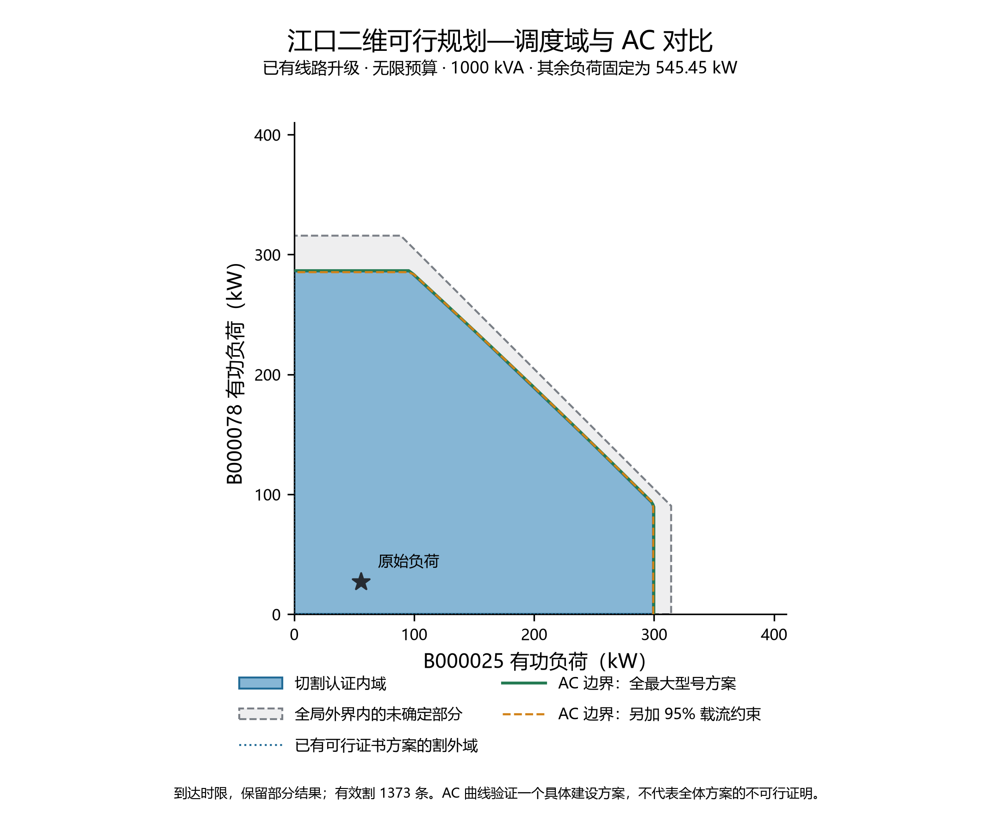
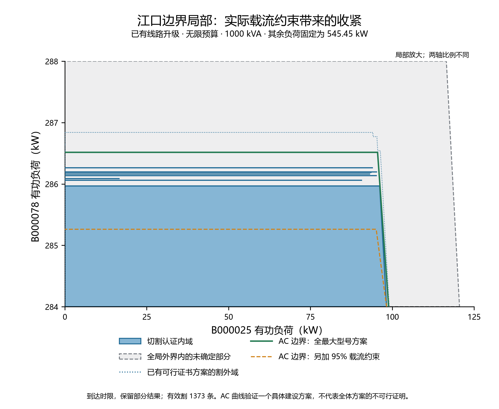

# 江口二维规划—调度域测试结果

已有线路升级、无限预算、1000 kVA；两个可变负荷为 B000025 和 B000078，其余负荷固定为 545.4525 kW。负荷坐标是建筑总有功，功率因数固定为 0.95。本次使用 methods 环境，所有试验代码、改动和结果位于 tests/jiangkou_2d。

**结论：切割方法已得到非空、可由 AC 潮流复核的二维可行内域。全局搜索状态为“达到 3600 秒上限，保留部分结果”。** 未确定部分保留在图和原始结果中，不作为不可行结论。

| 构域结果 | 数值 |
|---|---:|
| 连续内域面积 | 66115.496 kW² |
| 全部联合割投影得到的全局外界面积 | 73802.622 kW² |
| 内外面积差 / 该外界面积 | 10.416% |
| 保存的有效割 | 1373 |
| 搜索记录中的方案 | 1068 |
| 其中有可行点证书的方案 | 8 |
| 内域最大 B000025 负荷 | 299.2472 kW |
| 内域最大 B000078 负荷 | 286.2663 kW |
| 内域最大两点负荷之和 | 390.9491 kW |
| 构域累计耗时（含断点前已用时间） | 3600.52 s |
| 主问题求解累计耗时 | 500.01 s |
| 连续子问题累计耗时 | 230.75 s |
| 几何处理与逐步保存累计耗时 | 2542.97 s |
| 构域 / AC 阶段上限 | 各 3600 s |

物理剩余域搜索 180 s 尚无有效新见证后，继承所有割和证书切换 light。无限预算测试使用有效总负荷外界，直接搜索未覆盖区域，不等待与本次目标无关的最低投资或最大总负荷最优性证明。每条线路仍保留独立型号选项，未将规划固定成全最大型号。

**计时限制**：本次逐步保存完整方案和割的开销较重，计入几何处理时间。3600 秒是包含这些工作的构域总预算，不能直接当作 Gurobi 求解耗时，也不能仅凭这一总时间判断算法性能。停止后的最终结果落盘产生了少量附加时间。

全局外界的计算遵循：每条线恰选一种型号，因此对每条联合割 a+b·p+d·x≥0，以各线路型号组内 d 系数最大值之和替代 d·x，得到对所有选型都成立的负荷外界。这个外界仍可能宽于真实域；不同方案的内域始终取并集，不跨方案取凸包。

## AC 对比

使用 100×100 网格（共 10000 点，步长 4.045475 kW），并用 101 条射线二分计算全最大型号方案的 AC 参考边界。射线半径区间不超过 0.000096 kW；另做 95% 载流阈值检查。

| AC 检查 | 结果 |
|---|---:|
| 切割内域采样点 | 4047 |
| 内域中已有 AC 可行证书 | 4047（100.00%） |
| 内域中 AC 尚未获证 | 0 |
| AC 可行但尚未收入切割内域 | 6 |
| AC 可行却在全局外界外 | 0 |
| 按相同支撑方案复核的内域样本 | 4047 |
| 相同支撑方案 AC 失败 / 未确定 | 0 / 0 |
| 内域顶点 AC 检查 / 失败 / 未确定 | 21 / 0 / 0 |
| 同口径 AC 通过，但超过 95% 载流阈值的内域顶点 | 16 |
| 独立 Newton–Raphson 交叉核验 | 8 个工况 |
| 两套 AC 实现最大电压幅值差 | 1.98e-12 p.u. |
| AC 核验耗时 | 11.28 s |

AC 边界曲线对应**全最大型号这个具体方案**；网格可行判定取已验证建设方案的并集。某一方案不通过，不能推出所有方案都不可行。未验证点不计作失败，也不据此报告全局误判率。

网格步长约 4.05 kW，可能跨过不到 1 kW 宽的边界差异，因此“网格内全部通过”不能替代顶点和射线的严格载流检查。两类检查在表中分别报告。

| 全最大方案的 AC 边界截点 | 项目原有约束 | 另加 95% 载流约束 |
|---|---:|---:|
| B000078=0 时，B000025 上限 | 299.8183 kW | 299.3142 kW |
| B000025=0 时，B000078 上限 | 286.5156 kW | 285.2620 kW |
| 两个负荷相等时，各自上限 | 194.4671 kW | 194.4671 kW |

在这个 AC 参考方案下，B000025 轴向边界主要由 EE000020-03 的线路容量限制，B000078 轴向边界主要由 EE000019-02 限制；两个负荷相等时，先达到源端 1000 kVA 上限。代表边界的电压仍高于 0.93 p.u.。

101 条射线的折线近似面积为 66342.480 kW²；附加载流阈值后为 66173.438 kW²。这是边界采样面积，不是全局精确面积证书。当前内域相对这条 AC 参考边界的面积差约为 0.342%。

项目把线路容量表示为送端有功限值。它与实际电流阈值略有差别：抽查 AC 边界中，最大电流达到 95% 阈值的约 100.303%；切割内域顶点对应方案的最大值为 100.297%。因此同口径 AC 潮流通过，并不自动代表额外的严格载流检查也通过。两条边界均在图中保留。这里是按江口网架和本次参数进行的 AC 计算，不是实测运行校验。

原始负荷点 (55.56, 27.12) kW 在全最大升级方案下最低电压 0.987080 p.u.、源端视在功率 666.106 kVA、网损 4.319 kW。原网架在原始负荷下最低电压 0.932322 p.u.，最大电流为设定载流阈值的 148.13%，不满足线路约束。

## 文件与复现

- `run_domain.py`：从已有断点继续构域，累计时限 3600 s。
- `run_ac.py`：对保存结果进行 AC 网格、边界和独立潮流检查。
- `plot_result.py`：绘制 PNG / PDF / SVG。
- `results/domain.json`：状态、连续内外多边形、选型、所有割、计时与求解统计。
- `results/ac_grid.npz`、`ac_boundary.json`、`ac_points.json`：AC 样本、边界及代表工况。
- `source_manifest.json`：测试快照来源；`source/` 中为试验副本，未接入正式入口。

运行版本见 [环境记录](results/environment.json)。在已安装项目依赖的 Python 环境中，先运行 `run_domain.py`，再运行 `run_ac.py`、`plot_result.py` 和 `report_result.py`。

主线文件由本测试只读；实验期间检测到外部变化的文件为 plot.py，未覆盖或回退它们。测试结果仍对应最初冻结的数据及源码副本。
